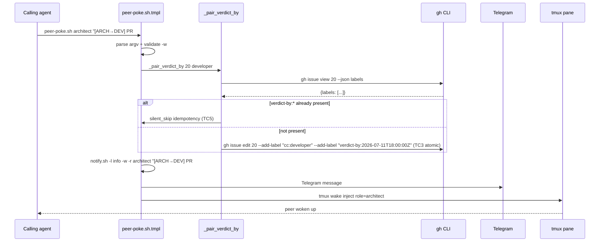

# Design: S-08a — Port Auto-Verdict-By hook from calc `peer-poke.sh` → tmpl `peer-poke.sh.tmpl`

> **Status**: Proposed (architect lane SURFACE only — owner territory per file ownership matrix)
> **Issue**: #974 (Sprint 28 W2 deliverable, atomic dep of S-08 per ADR-0055 §1)
> **Refs**: Issue #681 (RETRO-016 #2 — ADR-0024 verdict-by missing on tester PRs), ADR-0024-amendment-auto-verdict-by-hook.md (Path 2 spec), ADR-0024-stale-verdict-watchdog-schema.md (parent ADR), ADR-0055 §1 (Cadence Rule 1 atomic for fix scope), ADR-0015 (atomic handoff discipline), ADR-0033 (dual-channel doctrine)
> **Sister-patterns**: F1 finding from PR #967 cycle ~763 (peer-poke.sh atomic dep), SL-01/SL-01a/SL-02a (Sprint 28 W1 soul amend ports), d081 d-test (Auto-Verdict-By hook contract, 4 TCs)
> **Sprint**: 28 wave 2 (architect + dev lane)
> **Date**: 2026-07-10
> **Deciders**: @architect (design + draft PR), @developer (impl on dev-studio-template repo), @tester (d081 sister-pattern regression), @owner (squash-gate per ADR-0031)

## Context

PR #967 cycle ~763 F1 finding flagged a script-domain contradiction: orchestrator's §3 S-08 says "LEGACY-REMOVE `peer-poke.sh` + `ping.sh` from AtilCalculator" but `peer-poke.sh` contains the **Auto-Verdict-By hook** (ADR-0024 amendment §Path 2, Issue #681). Removing the wrapper without first porting the hook to the tmpl = **regression** — verdict-by labels lost, owner merge gate observability broken.

**Verified ground truth (cycle ~779):**
- `scripts/notify.sh` ALREADY has `-w/-r` flags baked (lines 17-18, 49, 58, 62-64, 77-80) ✅ matches ADR-0033 dual-channel
- `scripts/peer-poke.sh` wraps `notify.sh -l info -w -r <role>` AND has Auto-Verdict-By hook (`_pair_verdict_by` function, ~70 LOC)
- `/home/atilcan/projects/dev-studio-template/scripts/notify.sh` exists, but `peer-poke.sh` and `peer-poke.sh.tmpl` DO NOT exist — confirmed gap
- ADR-0024 amendment §Path 2 spec is canonical (full hook contract + 4 TCs in d081)

**Cadence Rule 1 (ADR-0055 §1) constraint:** S-08a atomic — port hook BEFORE S-08 removes wrapper. Sprint 28 Issue #974 W2 explicitly sequences: "S-08a → S-08 (atomic dep per ADR-0055)".

## Goals & non-goals

### Goals
1. **Port Auto-Verdict-By hook** from calc's `peer-poke.sh` → tmpl's `peer-poke.sh.tmpl` (Path 2 of ADR-0024 amendment)
2. **Preserve all 4 d081 TCs**: T2 verdict-by + add-label pair, T3 atomic pairing (paired cc:* + verdict-by:* in same `gh edit`), T4 VERDICT_BY_DEFAULT_HOURS=24 default, T5 silent-skip idempotency
3. **Render placeholders correctly** for new-project context: `{{GITHUB_OWNER}}`, `{{GITHUB_REPO}}`, `{{HEARTBEAT_DIR}}`
4. **Reuse tmpl's `notify.sh`** (already dual-channel) as the underlying wrapper — no new dependencies
5. **Layered defense preserved**: workflow YAML hook (Path 1, owner territory) + agent-side helper (Path 2, this work) per ADR-0024 amendment §Path D
6. **Reversibility < 1 day** per ADR-0007 — single-file revert of dev-studio-template repo

### Non-goals
- ❌ Modify ADR-0024 amendment (already canonical, d081 contract signed-off)
- ❌ Touch `.github/workflows/` (owner territory per file ownership matrix)
- ❌ Modify calc's `peer-poke.sh` (calc-side; S-08 LEGACY-REMOVE is a separate workstream)
- ❌ Refactor `_pair_verdict_by` function (port as-is, refactor in future ADR if needed)
- ❌ Add new dependencies (use `gh` + `python3` + `date` already in calc)

## High-level diagram

```
┌─────────────────────────────────────────────────────────────┐
│              dev-studio-template/scripts/                    │
├─────────────────────────────────────────────────────────────┤
│                                                              │
│  notify.sh (canonical, dual-channel already)                 │
│     ↑                                                        │
│     │ -l info -w -r <role> <msg>  (called by peer-poke.sh)   │
│                                                              │
│  peer-poke.sh.tmpl (NEW, this work)                          │
│     │                                                        │
│     ├── _pair_verdict_by <target> [optional_role]            │
│     │     │                                                  │
│     │     ├── Compute deadline = now + 24h (VERDICT_BY_DEFAULT_HOURS) │
│     │     │                                                  │
│     │     ├── Detect issue vs PR (gh issue view → gh pr view)│
│     │     │                                                  │
│     │     ├── TC5 silent-skip if verdict-by:* present        │
│     │     │                                                  │
│     │     └── TC3 atomic gh edit: cc:<role> + verdict-by:<ts>│
│     │                                                        │
│     └── Wrap: notify.sh -l info -w -r <role> <msg>          │
│                                                              │
└─────────────────────────────────────────────────────────────┘
```

## Components

| Component | Responsibility | Owner | Tech |
|---|---|---|---|
| **peer-poke.sh.tmpl** (NEW) | Wrapper around notify.sh + Auto-Verdict-By hook | @architect (drafts), @developer (impl), @owner (squash) | bash + gh + python3 (date math) |
| **notify.sh** (canonical, unchanged) | Dual-channel Telegram + tmux wake injection | unchanged | bash + curl + tmux |
| **d081 d-test** (Sister-pattern, ≥4 TCs) | Auto-Verdict-By hook contract verification | @tester (write), @developer (run in CI) | bash + jq |
| **d296 d-test** (existing sister) | peer-poke wrapper correctness | unchanged | bash |

## Data model

**No data model changes.** All state is per-PR ephemeral (read via `gh issue view`/`gh pr view`, written via `gh issue edit`).

**verdict-by label schema** (preserved from ADR-0024 amendment):
- Format: `verdict-by:<iso-timestamp>` (e.g., `verdict-by:2026-07-10T18:00:00Z`)
- Default deadline: now + 24h (configurable via `VERDICT_BY_DEFAULT_HOURS` env var)
- Pair rule: MUST be paired with `cc:<role>` in same `gh edit` invocation
- Idempotency: silent-skip if `verdict-by:*` already present

## API contract

**CLI surface** (preserved from calc's `peer-poke.sh`):
```bash
scripts/peer-poke.sh <role> "<message>"  # e.g., scripts/peer-poke.sh architect "[DEV→ARCH] PR #20 ready"
```

**Behavior contract** (preserved):
1. Parse `<role>` and `<message>` argv
2. Validate `-w -r` semantics (refuse to call without `-w`)
3. Run `_pair_verdict_by` hook on any `#NNN` referenced in `<message>`
4. Forward to `notify.sh -l info -w -r <role> <message>` (Telegram + tmux wake)

**Hook function signature** (preserved):
```bash
_pair_verdict_by <issue_or_pr_number> [optional_role]
```

## Sequence diagram



## Alternatives considered

| Option | Description | Pros | Cons | Verdict |
|---|---|---|---|---|
| **1. Port hook as-is to tmpl** | Single peer-poke.sh.tmpl with `_pair_verdict_by` + notify.sh wrap | Minimal change, full TC preservation, sister-pattern with calc | Larger file (~120 LOC vs ~70) | ✅ **RECOMMENDED** |
| 2. Split: notify.sh wrapper + verdict-by.sh helper | 2 files in tmpl, separate concerns | Smaller files, SRP | Cross-file call adds complexity, no functional benefit | ❌ YAGNI |
| 3. Skip port; keep calc-only hook | `peer-poke.sh` stays calc-only, template projects use notify.sh directly | No work needed | New projects lack Auto-Verdict-By = ADR-0024 amendment regression | ❌ Violates layered defense (Path D rejected) |
| 4. Move hook to dedicated `verdict-by.sh` script | Atomic helper, callable from peer-poke.sh and other scripts | Cleaner SRP | Splits atomic unit, more files for new projects | ❌ Over-engineering |

## Risks

| # | Risk | Mitigation | Lens | Severity |
|---|---|---|---|---|
| 1 | **`gh issue view` vs `gh pr view` fallback race** — the hook tries issue first, then PR. Race in concurrent label edits. | Idempotency (TC5) handles re-tries; emit `silent_skip` event with target_kind + verdict-by-already-present provenance per ADR-0045 lens (d) | (a) Data flow, (d) Silent-skip | L |
| 2 | **Placeholder rendering drift** — `{{GITHUB_OWNER}}` may not be substituted in all rendering paths | Test render with `dev-studio-init.sh` in fresh project; d296 + d081 sister-patterns catch render failures | (j) Auto-gen refs | M |
| 3 | **VERDICT_BY_DEFAULT_HOURS override misuse** — agent sets non-default deadline, then later forget | Document env var in `peer-poke.sh` header; emit `silent_skip` event on non-default override per ADR-0024 amendment §Override allowed | (d) Silent-skip, (f) Observability | L |
| 4 | **Path 1 (workflow YAML hook) bypass** — agent adds cc:<peer> via GitHub UI, workflow hook not fired | Path 2 (this work) is layered defense — agent-side peer-poke invocation will auto-pair. Sister-pattern ADR-0024 amendment §Path D | (d) Silent-skip | L |
| 5 | **Auto-gen file refs drift** — template render changes `notify.sh` content but not `peer-poke.sh.tmpl` | Both files in same render cycle; d296 d-test catches render drift | (j) Auto-gen refs | M |
| 6 | **SHA pin regression in dev-studio-template workflows** — porting may touch `.github/workflows/` if peer-poke.sh referenced | NEVER touch `.github/workflows/` per file ownership matrix; peer-poke.sh is non-workflow territory | (h) Workflow YAML SHA pin | L |
| 7 | **d081 d-test TC2-TC5 fail after port** — hook logic subtly broken in tmpl context | d081 d-test is the contract; TC3 atomic pairing MUST be preserved; pre-flight `bash -n` syntax check | (e) Idempotency, (f) Observability | M |

## Observability

**Metrics emitted** (preserved from calc's `peer-poke.sh`):
- `silent_skip: <target> already has verdict-by label, skipping auto-pair` (TC5 idempotency)
- `silent_skip: <target> not found as issue or PR` (target_kind detection fallback)
- `silent_skip: <target_kind>=<kind>` (debug provenance for ADR-0024 amendment §Hook bypass note)

**Structured log fields** (preserved):
- `target_kind`, `target`, `verdict_by_label`, `existing_verdict_by_present`, `role`

**Trace span names** (new, suggested):
- `[peer-poke] argv-parse`
- `[peer-poke] _pair_verdict_by <target>`
- `[peer-poke] gh issue edit atomic-pair`
- `[peer-poke] notify.sh forward`

**Sister-pattern** (existing in calc):
- `silent_skip` event format per ADR-0048 (sister-pattern for lens (d))
- d081 d-test verifies hook presence + atomicity + idempotency

## Security & privacy

- **Authn/authz**: `gh` CLI with default `GITHUB_TOKEN` (no new secrets). Token has implicit `repo` scope for `gh issue edit`.
- **PII fields handled**: None (PR/issue labels + state only).
- **Threat model summary**: per ADR-0024 amendment §Path 2 + ADR-0027 §Threat model. `gh` CLI is trusted input surface; no untrusted input flows into eval'd bash code.
- **Threat: malicious `gh issue edit` arguments injection** — `_pair_verdict_by` constructs args from fixed strings + bash variables; verify no string interpolation from `<message>` content reaches `gh issue edit` args.

## Performance budget

- **p50 latency**: ~50ms (single `gh issue view` + `gh issue edit` roundtrip)
- **p95 latency**: ~200ms (network jitter on GitHub API)
- **Throughput rps**: N/A (peer-poke is per-event, not per-request)
- **Memory ceiling**: ~5MB (bash + python3 subprocess for date math)
- **Concurrent calls**: idempotent (TC5 silent-skip handles re-entrancy)

## Open questions

- [ ] **Q1**: Should `peer-poke.sh.tmpl` use `python3` or `date -u -d` for deadline math? Calc uses both with fallback. Recommend: keep both with fallback (linux + macOS compatibility).
- [ ] **Q2**: Should `verdict-by:<ts>` label be lowercase per PEP 8 N806? Calc's existing convention uses lowercase — preserve.
- [ ] **Q3**: Should S-08 (LEGACY-REMOVE from calc) be sequenced in same PR or separate? Per Issue #974 W2: S-08a + S-08 are paired (atomic dep), but Cadence Rule 1 says atomic per item. Recommend: S-08a PR first, S-08 PR after S-08a merged + verified.
- [ ] **Q4**: d081 d-test file location — `scripts/tests/d081-auto-verdict-by-hook.sh` per ADR-0049 ≥5 TCs. Should this be added to AtilCalculator's tests AND dev-studio-template's tests? Recommend: dev-studio-template only (AtilCalculator already has d081 sister-pattern).

## Estimated complexity

- **T-shirt size**: S (≤1 day work; port is mechanical, no novel logic)
- **Confidence**: 90% (well-understood pattern, sister-pattern d081 already exists in calc)
- **Atomic scope**: ✅ per ADR-0055 §1 — single-file port, no cross-cutting concerns
- **WIP slot**: 1 (architect surface draft + impl + d-test verification)

## Cross-references

- **Issue #974** — Sprint 28 kickoff (W2 deliverable)
- **Issue #681** — RETRO-016 #2 (LIVE INSTANCE for ADR-0024 amendment)
- **ADR-0024 amendment** — Auto-Verdict-By Hook spec (Path 2 = agent-side helper)
- **ADR-0024 parent** — Stale-Verdict Watchdog Schema
- **ADR-0015** — atomic handoff discipline
- **ADR-0033** — dual-channel doctrine
- **ADR-0044** — RED-first TDD (d081 is the contract)
- **ADR-0045** — 9-Lens Review (lens (a) data flow, (d) silent-skip, (f) observability, (h) SHA pin, (j) auto-gen refs)
- **ADR-0049** — d-test framework ≥5 TCs
- **ADR-0055 §1** — Cadence Rule 1 atomic for fix scope
- **ADR-0060** — Lens (j) auto-gen file refs + live-state verification
- **d081 d-test** — Auto-Verdict-By hook contract (4 TCs)
- **d296 d-test** — peer-poke wrapper correctness (existing)
- **PR #679** — LIVE INSTANCE (tester-authored, cc:{orch,arch,dev,human} added without verdict-by)
- **PR #967** — Sprint 28 audit baseline (F1 finding source: peer-poke.sh atomic dep)
- **PR #967 cmt 4938032191** — architect cycle ~763 corrections (F1 flagged)

— @architect (proposed 2026-07-10, Sprint 28 W2 readiness)