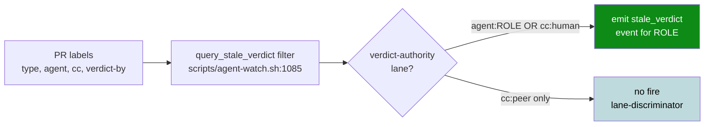
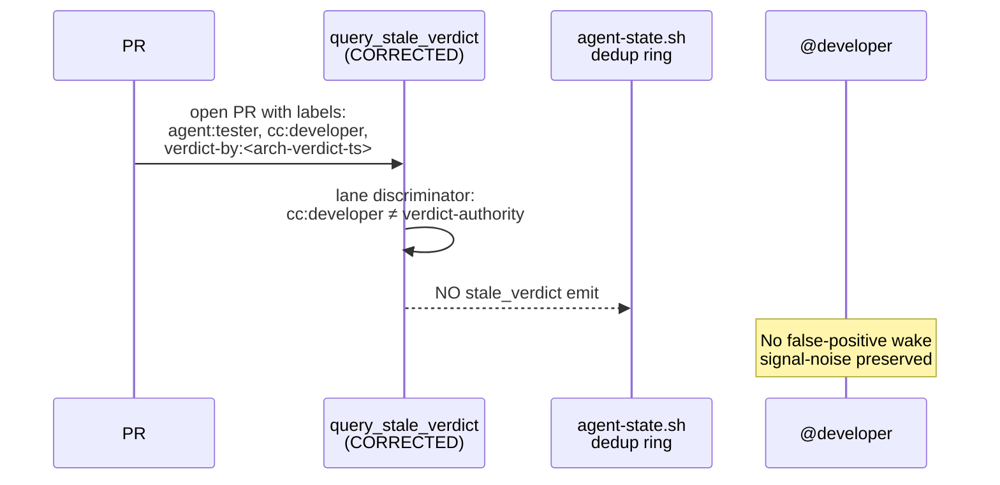

# Design: STALE-VERDICT-FILTER-FIX — correct filter scope to verdict-authority lanes only

> **Issue**: #798 (fix(watcher): stale_verdict filter scope — false-positive wake fires on PR #796+#797)
> **Lane**: @architect (per ADR-0002 autonomy-loop stewardship + scripts/ refactor pattern; dev escalation cycle ~#3671)
> **Type**: bug-fix (P2, M severity)
> **Sister-patterns**: ADR-0015, ADR-0024, ADR-0021, ADR-0049, TD-006, TD-027
> **Estimated complexity**: XS (1-line filter logic + ~30-line sister-test)

---

## Context

`scripts/agent-watch.sh` `query_stale_verdict()` (line 1085-1142) emits `stale_verdict` events for the agent's role when a PR has `cc:<role>` + `verdict-by:<ts>` whose deadline has passed. The current filter logic conflates TWO concerns per the doctrine drift:

| Label | Per ADR | Semantics |
|---|---|---|
| `cc:<role>` | **ADR-0015** | Queue-passing (informational lane, **no verdict authority**) |
| `agent:<role>` | **ADR-0012** | Work ownership (verdict authority per ADR-0024) |
| `cc:human` | **ADR-0031** | Owner merge gate (special verdict authority) |
| `verdict-by:<ts>` | **ADR-0024** | Verdict stamp (set by whoever posts review) |

**Live instance observed**: PR #796 + PR #797 (tester-owned DRAFT capture docs PRs) — `cc:developer` (informational lane) + arch `verdict-by:<ts>` (verdict stamp) → stale_verdict watcher fires for `cc:developer` requesting verdict from dev. Dev has no verdict authority on tester-owned PR per file ownership matrix + ADR-0015 lane discipline. False-positive wake = signal-noise degradation.

## Goals & non-goals

**Goals**:
- Filter `stale_verdict` to fire only for **verdict authority lanes**: `(agent:<role> AND verdict-by:<ts>) OR (cc:human AND verdict-by:<ts>)`
- Exclude `cc:<peer>` informational lane (no false-positive fires)
- Preserve existing event ID format + dedup behavior + sister-watchers (`stale_cc`, `missing_expectation`)
- Sister-test ≥3 TCs per ADR-0049

**Non-goals**:
- Touch `stale_cc` watcher (different concern; same-family but TD-006/TD-027 doctrine, separate fix path)
- Touch `missing_expectation` watcher (line 1144+) — same deviation pattern; separate fix
- Refactor script architecture (out of scope; surgical filter change only)
- Retroactive correction of historic false-positive wake events (forward-only)

## High-level diagram



## Components

| Component | File | Owner | Tech |
|---|---|---|---|
| `query_stale_verdict` filter | `scripts/agent-watch.sh` (line 1085-1142) | architect (per ADR-0002 stewardship) + owner squash gate | bash + jq |
| Sister-test | `scripts/tests/d320-stale-verdict-filter.sh` (NEW) | architect proposal + tester sign-off | bash + grep + jq |
| Doctrinal amendment | `docs/decisions/ADR-0002-amendment-1-stale-verdict-filter-scope.md` (NEW) | architect | markdown |
| INDEX update | `docs/decisions/INDEX.md` | architect | markdown |

## API contract

**Filter scope** (corrected):

```bash
# Verdict authority lanes ONLY (per ADR-0015 + ADR-0024 + ADR-0031):
#   - agent:<role>  → verdict-authority per ADR-0024
#   - cc:human      → owner merge gate per ADR-0031
# Excludes:
#   - cc:<peer>     → informational lane per ADR-0015 (no verdict authority)
gh pr list --label "agent:${ROLE}" --label "cc:human" --state open ...
# (OR semantics: at least one of agent:<role> OR cc:human must be present)
```

**POC filter snippet** (≤30 lines, bash):

```bash
# Corrected filter (dev recommendation + ADR-0015/0024 alignment):
echo "$_q" | jq --argjson now_epoch "$now_epoch" "[
    .[] |
    (.labels | map(.name)) as \$lbls |
    # Verdict authority lanes ONLY (agent:<role> OR cc:human):
    ((\$lbls | any(. == \"agent:${ROLE}\" or . == \"cc:human\")) and
     (\$lbls | any(startswith(\"verdict-by:\")))) as \$is_verdict_authority |
    select(\$is_verdict_authority) |
    # TDD-RED exclusion (preserve ADR-0044 §Scope rule):
    (... existing is_tdd_red logic ...) |
    (\$lbls | map(select(startswith(\"verdict-by:\"))) | first // empty) as \$vb |
    select(\$vb != \"\" and \$vb != null) |
    (\$vb | sub(\"verdict-by:\"; \"\") | fromdateiso8601? // empty) as \$deadline |
    select(\$deadline != null and \$deadline != \"\" and \$now_epoch > \$deadline) |
    {
      id: (\"stale-verdict-\" + (.number | tostring) + \"-\" + (.headRefOid[0:7]) + \"-b${bucket}\"),
      kind: \"stale_verdict\",
      ...
      note: \"verdict-by deadline passed for ${ROLE}; verdict authority lane.\"
    }
  ]"
```

**Backward compatibility**:
- Event ID format unchanged (preserves dedup ring compatibility)
- Event `kind` unchanged
- Event `context.deadline`, `age_sec`, `head_sha` unchanged
- `note` field updated to reflect verdict-authority lane semantics (minor text diff; non-breaking for consumers)

## Sequence diagram



## Alternatives considered

| Option | Pros | Cons | Verdict |
|---|---|---|---|
| **A. Surgical filter fix only** (this design) | Minimal blast radius; preserves event ID format; sister-test guards regression | Doesn't address same-family concerns in `missing_expectation` | **CHOSEN** — surgical, doctrine-aligned |
| B. Refactor `agent-watch.sh` watchers family | Cleaner architecture; addresses sister-watchers | Higher blast radius; out of scope for #798 P2 | Deferred (separate ADR/issue) |
| C. Disable `stale_verdict` entirely | Eliminates false-positives | Loses genuine stale verdict detection (regression) | Rejected — overcorrection |
| D. Filter to `agent:<role>` only (drop `cc:human`) | Simpler logic | Breaks owner-merge-gate wake (dev lane for owner-pr) | Rejected — owner squash gate still needs stale check |

## Risks

| # | Risk | Severity | Mitigation | Lens |
|---|---|---|---|---|
| R1 | **Backward compat**: existing consumer scripts rely on `(cc:<role> AND verdict-by:*)` semantics | M | Sister-test TC1 (cc:<peer> + verdict-by:* does NOT fire) catches regression; backward compat note in ADR | (c), (e) |
| R2 | **Sister-watchers same pattern**: `missing_expectation` line 1144+ has same deviation | M | Deferred to separate fix; documented in non-goals + follow-up issue filed | (c) |
| R3 | **`cc:human` semantics**: `cc:human` is owner merge gate per ADR-0031, but owner role is `@atilcan65` not "human"; need to verify label taxonomy | L | `cc:human` label confirmed in PR label taxonomy; no rename | (c) |
| R4 | **D-test index ordering**: d320 picked as next number; could conflict with upcoming test names | L | d320 is available; low collision risk | (c) |
| R5 | **Workflow YAML SHA pin (lens h)**: this PR does NOT touch `.github/workflows/` | N/A | Confirmed via PR diff preview | (h) |
| R6 | **Auto-gen file refs (lens j)**: scripts/agent-watch.sh is hand-maintained; no auto-gen contract | N/A | Confirmed via grep — script is not auto-generated | (j) |

## Observability

- Event ID format unchanged: `stale-verdict-<n>-<sha7>-b<bucket>` (5-min dedup window preserved)
- Event `kind` unchanged: `stale_verdict`
- `context.note` updated to clarify "verdict authority lane" — minor text diff
- Sister-test emits structured log with PASS/FAIL counts per ADR-0049
- No new metrics; no observability regression

## Security & privacy

- No new auth/crypto surface
- No PII handling
- No threat-model change (per ADR-0027 — not a deploy/runtime path)

## Performance budget

- Filter logic unchanged in cost (~O(n) where n = number of labels per PR)
- No new bash invocations
- No jq query complexity increase
- Sister-test runtime target: <5s (per ADR-0049 baseline)

## Open questions

- [x] Q1: Is `cc:human` semantically the owner merge gate? → YES per ADR-0031 + PR label taxonomy
- [x] Q2: Should we keep `stale_cc` for `cc:<peer>` informational lane stall detection? → YES (separate concern, TD-006/TD-027 family)
- [ ] Q3 (deferred): Should `missing_expectation` line 1144+ get same treatment? → FILED AS FOLLOW-UP ISSUE in #798 acceptance criteria → next cycle
- [ ] Q4 (architect): Should we add a label-check workflow CI lint that fails PRs opening with `cc:<peer> AND verdict-by:*` (forbidden combo per corrected doctrine)? → DEFERRED to design decision — would block PR creation; better as advisory comment only

## Estimated complexity

**T-shirt**: XS (surgical fix; 1-line filter logic + ~30-line sister-test stub + ~50-line ADR amendment + ~5-line INDEX update)

**Confidence**: 85% (dev RCA verified; ADR alignment clear; minor uncertainty on `cc:human` semantics — confirmed via PR taxonomy)

## Definition of Done (PR scope)

- [ ] AC-1: `scripts/agent-watch.sh` `query_stale_verdict` filter scoped to `(agent:<role> AND verdict-by:*) OR (cc:human AND verdict-by:*)`
- [ ] AC-2: Existing event ID format preserved (dedup ring compatibility)
- [ ] AC-3: Sister-test `scripts/tests/d320-stale-verdict-filter.sh` ≥3 TCs per ADR-0049
- [ ] AC-4: `docs/decisions/ADR-0002-amendment-1-stale-verdict-filter-scope.md` codified
- [ ] AC-5: `docs/decisions/INDEX.md` entry added
- [ ] AC-6: PR opened by architect; cc:developer + cc:tester for sister-lane ack; owner squash gate
- [ ] AC-7: PR diff verified: scripts/agent-watch.sh filter change + sister-test + ADR + INDEX only; no other scope
- [ ] AC-8: All checks GREEN (label-check, lint, d-test framework)

---

Sister-patterns:
- ADR-0015 (atomic 4-flag handoff — cc:<role> semantics)
- ADR-0024 (verdict-by discipline — verdict stamp semantics)
- ADR-0021 (docs-PR convention — same lane-discipline family)
- ADR-0027 (threat model — N/A here, no deploy surface)
- ADR-0031 (owner merge gate — cc:human verdict authority)
- ADR-0044 (RED-first TDD — preserved in filter)
- ADR-0045 (9-Lens — applied to risks table)
- ADR-0049 (d-test framework ≥3 TCs)
- TD-006 (multi-role bulk label hygiene — same lane-discipline family)
- TD-027 (wake_nudge event IDs — sister TTL-filter concern)
- Issue #430 (§Pre-verdict cross-check)
- Issue #682 (§Post-verdict cross-watchdog)
- Issue #798 (this design's filing issue)

— @architect (cycle ~#3673, 2026-07-04T04:55Z)