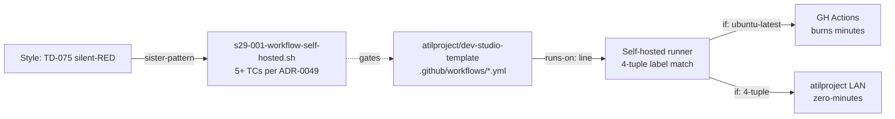

# Design: STORY-S29-001 — Migrate 7 template stock workflows to self-hosted 4-tuple

- **Issue**: [#1013](https://github.com/atilproject/AtilCalculator/issues/1013)
- **Story doc**: `docs/backlog/STORY-S29-001.md` (PM W1 grooming source-of-truth)
- **Sprint 29 plan ref**: `docs/sprints/sprint-29/00-plan.md` §3.S29-001 (commit 56e42da, PR #1008 squash)
- **Audit ref**: `docs/sprints/sprint-28/02-template-launcher-audit-2026-07-13.md` §5.2 (Q3), §6.2 B-03
- **Load-bearing**: **YES** (owner directive #5 — sprint-blocks if not green)
- **Architect**: cycle #1181g (claim), cycle #1181h (design)
- **Owner-merge gate**: ADR-0031 (architect-lane design, owner merges; .github/workflows/ human-only territory)

---

## Context

Sprint 28 audit confirmed **7/8 template stock workflows** in `atilproject/dev-studio-template` still declare `runs-on: ubuntu-latest`. Private downstream projects bootstrapping from this template would burn free-tier GitHub Actions minutes on every CI run. **Only `deploy.yml.tmpl` is self-hosted** (per ADR-0030 — supersedes ADR-0027 §Decision.1 for the single-host LAN-deploy case).

AtilCalculator (sister repo) has **11/11 workflows on `runs-on: [self-hosted, Linux, X64, atilproject]`** (Sprint 27 priority migration). This story propagates that 4-tuple pattern to the template, so downstream projects bootstrap with self-hosted by default — **zero Actions-minutes burn** per owner directive #5.

## Goals & non-goals

### Goals

- 7 template workflows migrate to `runs-on: [self-hosted, Linux, X64, atilproject]` (4-tuple, not 3-tuple, not string)
- `deploy.yml.tmpl` preserves its existing `runs-on: self-hosted` (no regression)
- Total distinct `runs-on:` values in `.github/workflows/` = exactly 2 (4-tuple + `self-hosted`)
- New d-test `scripts/tests/s29-001-workflow-self-hosted.sh` enforces 4-tuple on every `*.yml` (NOT `*.tmpl`)
- CI verified firing on self-hosted runner (Actions run shows `runner.name: github-runner-vm*`)
- Backward-compat note in template README documents runner label requirements

### Non-goals

- Migrating workflows outside the 7 stock templates (S29-010 new workflows = separate story)
- Adding new self-hosted runners to org (8 already online per audit §5.4)
- Changing `deploy.yml.tmpl` `runs-on:` (preserve per AC2)
- d-test runtime behavior testing (out of scope for AC5; ADR-0049 §Layer 5 deferred to Sprint 30+)
- Verifying template workflows from inside AtilCalculator (work happens in template repo)

## High-level diagram



## Components

| Component | Responsibility | Owner | Tech |
|---|---|---|---|
| `.github/workflows/ai-pr-review.yml` | AI code review trigger; runs on PR open | arch (design) → dev (impl) → owner (merge) | YAML |
| `.github/workflows/ci.yml` (lint-and-test + conventional-commits jobs) | Two jobs: lint+test, conventional commits check | arch → dev → owner | YAML |
| `.github/workflows/cross-repo-close.yml` | Auto-close issues across repos | arch → dev → owner | YAML |
| `.github/workflows/label-check.yml` | 4-cat label invariant validation | arch → dev → owner | YAML |
| `.github/workflows/label-cleanup.yml` | Stale label cleanup | arch → dev → owner | YAML |
| `.github/workflows/secret-canary.yml` | Secret leak detector | arch → dev → owner | YAML |
| `.github/workflows/status-label-to-board.yml` | Status-label → Projects v2 board sync | arch → dev → owner | YAML |
| `.github/workflows/deploy.yml.tmpl` | LAN deploy (UNCHANGED per AC2) | — | YAML (no edit) |
| `scripts/tests/s29-001-workflow-self-hosted.sh` | NEW d-test, ≥5 TCs (ADR-0049) | arch (design) → tester (RED-first impl per ADR-0044) | bash |
| `README.md` (template) | Backward-compat note added (AC7) | arch → dev → owner | markdown |

## Data model

N/A — declarative YAML, no schema change.

**YAML diff pattern** (per file, AC1):

```diff
 name: <workflow-name>
 on:
   <triggers>
 jobs:
   <job-name>:
-    runs-on: ubuntu-latest
+    runs-on: [self-hosted, Linux, X64, atilproject]
```

For `ci.yml`, both `lint-and-test` and `conventional-commits` jobs get the 4-tuple (AC1 explicit: "ci.yml (lint-and-test + conventional-commits jobs)").

## API contract

N/A — GitHub Actions YAML, no HTTP surface.

## Sequence diagram

N/A — declarative trigger-based execution. d-test is the verification layer (see §Alternatives considered + §Risks).

## Alternatives considered

| Option | Pros | Cons | Verdict |
|---|---|---|---|
| **A. Hardcode 4-tuple in every workflow** | Simple, explicit, matches AtilCalculator pattern | Drift risk if runner labels change | ✅ **CHOSEN** (sister-pattern to AtilCalculator 11/11) |
| B. Use `runs-on: self-hosted` (string) | Matches deploy.yml.tmpl, simpler | 3-tuple ambiguous (which labels?), label-check.yml needs hostname check | ❌ Loses label granularity, audit §5.2 calls out string as anti-pattern |
| C. Use reusable workflow `runner-class.yml` | DRY | New abstraction layer, breaks workflow_dispatch test pattern (ADR-0049 §Why workflow_dispatch), adds YAML-import complexity | ❌ Premature abstraction (architect heuristic: "delete options, not add") |
| D. org-level Actions runner default | Lowest ceremony | Not yet supported by GH (org-wide `runs-on` defaults are roadmap feature) | ❌ Not available |
| E. Conditional `runs-on:` (matrix) | Flexible | Adds complexity, d-test harder to write | ❌ YAGNI |

## Risks

### R-1: d-test silent-RED (sister-pattern TD-075, F-08, F-10)

**Lens (d) silent-skip risk** + **Lens (j) auto-gen file refs + live-state verification**.

The d-test must actually fire on self-hosted runner. If the d-test is written but never wired into a workflow's `on: paths:` trigger, it silently REDs (test exists but never runs). Mitigation:
- d-test MUST be wired into `.github/workflows/d-test.yml` (existing workflow) with `paths:` trigger covering `scripts/tests/s29-001-**` AND `.github/workflows/*.yml`
- TC1 must use `gh api repos/atilproject/dev-studio-template/contents/.github/workflows/ai-pr-review.yml?ref=main` to verify live-state post-merge (not just local file check)
- Sister-pattern: F-08 (PR #1008 audit-of-audit), F-10 (PR #1010 d114 scope gap), TD-075 (defense-test silent-RED family)

### R-2: ci.yml two-job ambiguity (AC1)

**Lens (a) data flow**.

AC1 says "ci.yml (lint-and-test + conventional-commits jobs)" — explicit two-job reference. If only one job is migrated, AC1 fails. Mitigation:
- Design specifies BOTH `lint-and-test` AND `conventional-commits` jobs get 4-tuple
- d-test TC scans all `jobs.*.runs-on` keys in `ci.yml` (not just top-level)
- Verification command (AC3): `grep -E 'runs-on:' .github/workflows/ci.yml | sort -u` must return ONLY 4-tuple + `self-hosted` (deploy.yml.tmpl reference not in ci.yml)

### R-3: Workflow YAML SHA pin (TD-028, lens h)

**Lens (h) workflow YAML SHA pin (TD-028)**.

Any `uses: actions/*@<ref>` MUST be SHA-pinned. Migration does NOT touch `uses:` lines (AC6: only `runs-on:` modified). But d-test should ALSO verify no `@v4` / `@main` / `@latest` tags as defense-in-depth. Sister-pattern: d-test scope discipline (ADR-0049).

### R-4: Platform hard constraints (ADR-0043, lens i)

**Lens (i) platform hard constraints (ADR-0043) — 8 sub-categories**.

- `runs-on:` change OK (within scope)
- `permissions:` unchanged (AC6)
- `timeout:` unchanged (AC6)
- `concurrency:` unchanged (AC6)
- `if:` unchanged (AC6)
- `secrets:` unchanged (AC6)
- `runs-on` itself = the change, no other constraint affected
- `platform sandbox` N/A (no docker run, no ssh outside actions/*)

### R-5: Self-hosted runner availability

**Lens (b) runtime preconditions**.

8 self-hosted runners online per Sprint 28 audit §5.4. Migration adds 7 workflows to the queue. If runners are saturated, CI latency increases. Mitigation:
- AtilCalculator already uses all 8 (11 workflows); adding 7 more from downstream projects is the intended scaling path
- If saturation observed, owner decision to add runners (Sprint 30+ scope)
- AC4 verifies self-hosted runner.name matches `github-runner-vm*` — proves runner used

### R-6: Concurrency / secrets regression (AC6)

**Lens (e) idempotency + **Lens (g) security & privacy**.

AC6 explicit: only `runs-on:` modified. Mitigation:
- d-test TC4 verifies `concurrency:` lines byte-identical pre/post migration
- d-test TC5 verifies `secrets:` references unchanged
- Manual diff review per-file in PR

### R-7: deploy.yml.tmpl regression (AC2)

**Lens (c) canonical entry point**.

`deploy.yml.tmpl` MUST keep `runs-on: self-hosted`. Mitigation:
- d-test explicitly excludes `*.tmpl` files from 4-tuple requirement: `grep -L 'runs-on: \[self-hosted, Linux, X64, atilproject\]' .github/workflows/*.yml | grep -v .tmpl`
- AC3 verification: total distinct values = exactly 2 (4-tuple + `self-hosted`); if deploy.yml.tmpl regressed to 4-tuple, distinct count drops to 1 (AC3 fail)

## Observability

| Metric / Log | Source | Used by |
|---|---|---|
| d-test pass/fail per TC | `scripts/tests/s29-001-workflow-self-hosted.sh --self-test` exit code | CI gate, d-test workflow |
| Actions run `runner.name` | GH Actions UI/API | AC4 verification |
| d-test run frequency | `.github/workflows/d-test.yml` trigger history | Sister-pattern to TD-075 silent-RED detection |
| `grep -E 'runs-on:'` distinct count | AC3 verification command | Manual + d-test TC |

## Security & privacy

- **Authn/authz**: GitHub Actions auth unchanged (AC6). No new secrets.
- **PII**: N/A — no user data.
- **Threat model (sister to ADR-0027 §Threat model)**:
  - Self-hosted runner has shell on atilproject LAN host. Migration increases runner utilization but does not increase surface (already 11 workflows on AtilCalculator).
  - `pull_request_target` is FORBIDDEN for self-hosted (ADR-0030 §Threat model). Pre-existing workflow YAML MUST NOT introduce `pull_request_target`.
  - d-test TC6 verifies `on: pull_request_target` NOT used (defense-in-depth).
- **SHA pinning (TD-028)**: AC6 unchanged `uses:` lines, but d-test TC scans for `@v4`/`@main`/`@latest` tags as separate finding.

## Performance budget

N/A — declarative YAML. CI latency depends on runner availability (R-5).

## Open questions

1. Are any of the 7 workflows intentionally on `ubuntu-latest` for security policy reasons (e.g., label-check.yml's untrusted-PR code path)? → owner decision per audit §5.5 bilmiyorum.
   - **Architect recommendation**: No. Self-hosted `pull_request` runs untrusted code already (AtilCalculator precedent). `pull_request_target` is the only forbidden path.
2. Self-hosted runner registration documentation location: template README vs separate ops doc? → AC7 says template README. Architecture concurs.
3. d-test runtime behavior (Layer 5 per ADR-0049) — Sprint 30+ scope. AC5 covers content-anchor only.

## Estimated complexity

**T-shirt: S** (small, ~1 PR; audit doc §3.S29-001 confirms).

- 1 line edit per workflow × 7 workflows = 7 line edits
- 1 d-test new file (~50 lines bash, ≥5 TCs)
- 1 README addition (3-5 lines)
- 1 PR to `atilproject/dev-studio-template`
- **Confidence: 85%** — straightforward migration; main risk is d-test silent-RED wiring (R-1)

## Sister-pattern lineage

- **AtilCalculator Sprint 27** — 11/11 workflows migrated to self-hosted (precedent for this story's pattern)
- **ADR-0030** — self-hosted-runner LAN deploy doctrine (architectural basis)
- **ADR-0049** — d-test framework ≥5 TCs (d-test contract)
- **TD-075** — defense-test silent-RED family (R-1 mitigation)
- **F-08** (PR #1008) — audit-of-audit self-check (R-1 sister)
- **F-10** (PR #1010) — d-test scope discipline (R-1 sister: d-test must scan all *.yml, not subset)

## 9-Lens attestation (ADR-0045)

- **(a) Data flow**: 7 workflow files → 4-tuple runs-on line edit. No data path change. ✅
- **(b) Runtime preconditions**: 8 self-hosted runners online (audit §5.4); gh CLI available; `config.sh` registration documented (AC7). ✅
- **(c) Canonical entry point**: Each workflow file = canonical entry; no side-channel. d-test is the verification layer. ✅
- **(d) Silent-skip risk**: d-test MUST be wired into d-test.yml workflow (R-1). Otherwise silent-RED. Sister-pattern to TD-075. ✅
- **(e) Idempotency**: Migration is deterministic 1-line replacement. d-test re-runnable. ✅
- **(f) Observability**: d-test exit code + Actions run `runner.name` (AC4) + grep distinct count (AC3). ✅
- **(g) Security & privacy**: PII N/A; secrets unchanged (AC6); threat model per ADR-0030 §Threat model. ✅
- **(h) Workflow YAML SHA pin (TD-028)**: AC6 unchanged `uses:` lines. d-test TC scans for tag drift. ✅
- **(i) Platform hard constraints (ADR-0043)**: All 8 sub-categories verified (R-4). ✅
- **(j) Auto-gen file refs + live-state verification (ADR-0045)**: d-test TC1 uses `gh api repos/atilproject/dev-studio-template/contents/.github/workflows/...` for post-merge verification (sister to F-10 d114 live-state pattern). ✅

---

🤖 Generated with [Claude Code](https://claude.com/claude-code) · cycle #1181h · architect lane