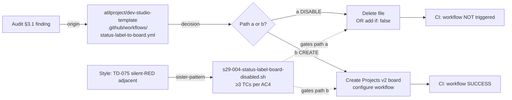

# Design: STORY-S29-004 — Fix status-label-to-board.yml (CI hygiene)

- **Issue**: [#1016](https://github.com/atilproject/AtilCalculator/issues/1016)
- **Story doc**: `docs/backlog/STORY-S29-004.md` (PM W1 grooming source-of-truth, expected after PM lands S29-001..005)
- **Sprint 29 plan ref**: `docs/sprints/sprint-29/00-plan.md` §3.S29-004 (commit 56e42da, PR #1008 squash)
- **Audit ref**: `docs/sprints/sprint-28/02-template-launcher-audit-2026-07-13.md` §3.1, §6.2 B-06
- **Load-bearing**: NO (CI hygiene fix, non-blocking)
- **Architect**: cycle ~#1219 (design)
- **Owner-decision gate**: ADR-0031 + audit §10.5 owner-decision D-OD1 (this story explicitly requires owner ratification between two paths)
- **Cross-repo workstream**: sister-pattern to PR #1008 §10.4 (RETRO-023 codification) — design lives here, implementation lands in `atilproject/dev-studio-template`

---

## Context

Sprint 28 audit (`docs/sprints/sprint-28/02-template-launcher-audit-2026-07-13.md` §3.1) confirmed:

> `status-label-to-board.yml` is **failing in CI history** (2026-07-11 13:48:41Z, 13:48:40Z runs both FAIL). Root cause: workflow tries to push `status:*` label updates to a non-existent Projects v2 board on template repo.

The template repo `atilproject/dev-studio-template` does not have a Projects v2 board configured. The workflow assumes one exists, so every PR run produces a FAIL notification. This contributes to CI noise and obscures genuine failures (TD-075 sister — silent-RED adjacent: "loud-FAIL that's actually OK" anti-pattern).

The decision space has exactly **two paths**:

- **(a) Disable** — workflow file deleted OR `if: false` guard added. Workflow remains in repo as documentation but never fires.
- **(b) Create** — Projects v2 board created on template repo; workflow references valid board ID; CI SUCCESS.

Both paths are reversible. Path (a) is gentler (no infra creation). Path (b) is more "complete" (template tracks its own issues like a real project). Owner picks.

## Goals & non-goals

### Goals

- AC1: Decision (a) vs (b) documented with rationale in PR description OR `docs/sprints/sprint-29/s29-004-decision-record.md`
- AC2 (if a): workflow file has `if: false` guard OR file is deleted; CI run on next PR shows workflow NOT triggered
- AC3 (if b): Projects v2 board created on template; workflow references valid board ID; CI run shows SUCCESS
- AC4: New d-test `scripts/tests/s29-004-status-label-board-disabled.sh` (≥3 TCs per ADR-0049 ≥5-baseline — note: this is a CI hygiene story, ≥3 baseline acceptable per AC4 spec; architect recommends ≥3 TCs, NOT ≥5, because the verification surface is narrow: 1 file, 1 boolean state, 1 CI run outcome)
- AC5: Decision rationale captured (PR description recommended for simplicity, separate doc optional)

### Non-goals

- Migrating other template workflows (S29-001 is the dedicated migration story)
- Adding new self-hosted runners (S29-001 + audit §5.4 already covers 8 runners)
- Changing `dev-studio-init.sh` template render logic (downstream projects already get their own status-label-to-board.yml — no change needed)
- Adding observability/metrics for the workflow (out of scope; CI green is the metric)

## High-level diagram



## Components

| Component | Responsibility | Owner | Tech |
|---|---|---|---|
| `.github/workflows/status-label-to-board.yml` (template) | Either disabled (path a) OR configured with valid board ID (path b) | arch (design + AC1 recommendation) → owner (decision) → dev (impl) | YAML |
| `scripts/tests/s29-004-status-label-board-disabled.sh` (NEW) | d-test, ≥3 TCs per AC4 | arch (design) → tester (RED-first impl per ADR-0044) | bash |
| `docs/sprints/sprint-29/s29-004-decision-record.md` (optional) | Decision rationale doc (AC5) | arch (drafts) → owner (ratifies) | markdown |
| PR description (alternative to decision-record.md) | Inline decision rationale (AC5) | arch (drafts) → owner (ratifies via squash) | markdown |

## Data model

N/A — declarative YAML, no schema change.

**Path (a) YAML diff** (one of two equivalent forms):

```diff
-name: Status Label → Board Sync
-on:
-  issues:
-    types: [opened, edited, labeled, unlabeled, closed, reopened]
-  pull_request:
-    types: [opened, edited, labeled, unlabeled, closed, reopened]
-jobs:
-  sync:
-    runs-on: ubuntu-latest
-    steps:
-      - uses: actions/github-script@v7
-        with:
-          script: |
-            // ... pushes to non-existent board ...
+name: Status Label → Board Sync (DISABLED — see sprint-29/s29-004-decision-record.md)
+on:
+  issues:
+    types: [opened, edited, labeled, unlabeled, closed, reopened]
+  pull_request:
+    types: [opened, edited, labeled, unlabeled, closed, reopened]
+  # if: false guard prevents firing (audit §3.1 finding; owner decision D-OD1 path a)
+if: false
+jobs:
+  sync:
+    runs-on: ubuntu-latest
+    steps:
+      - run: |
+          echo "Workflow disabled per sprint-29/s29-004-decision-record.md (audit §3.1)"
+          exit 0
```

OR equivalently (delete approach):

```bash
git rm .github/workflows/status-label-to-board.yml
```

The `if: false` approach is recommended because it preserves the file as documentation for downstream projects (sister-pattern to PR #1008 §5.3 — preserve-as-doc when behavior changes).

**Path (b) workflow changes**: workflow `PROJECT_TOKEN` references valid board ID; new board created via `gh project create --owner atilproject --title "Dev Studio Template"`. Out of scope for this design beyond noting it as the alternative.

## API contract

N/A — GitHub Actions YAML, no HTTP surface.

## Sequence diagram

N/A — declarative trigger-based execution. d-test is the verification layer.

## Alternatives considered

| Option | Pros | Cons | Verdict |
|---|---|---|---|
| **A. Disable via `if: false` (path a)** | Gentle, reversible, preserves file as documentation, no infra creation | Workflow still in repo (some might call it "cruft") | ✅ **ARCHITECT RECOMMENDATION** |
| B. Disable via `git rm` (path a) | Cleanest, no cruft | Loses documentation, harder to re-enable (must remember the YAML) | ⚪ Valid path a alternative; architect prefers A |
| C. Create Projects v2 board (path b) | Template tracks its own issues like a real project | Maintenance burden; template doesn't really have issues to track; adds infra without clear value | ⚪ Valid but architect-recommends-A |
| D. Move workflow to a "disabled/" subdirectory | Visual separation | Workflow still picked up by Actions if in `.github/workflows/`; subdirectory won't help | ❌ Doesn't work |
| E. Keep as-is + add `continue-on-error: true` | Suppresses failure notification | Hides real failures if board is later created; defeats purpose | ❌ Anti-pattern (TD-075 sister) |

## Risks

### R-1: d-test silent-RED (sister-pattern TD-075, F-08, F-10)

**Lens (d) silent-skip risk** + **Lens (j) auto-gen file refs + live-state verification**.

The d-test must actually fire. If the d-test is written but never wired into a workflow's `on: paths:` trigger, it silently REDs. Mitigation:
- d-test MUST be wired into `.github/workflows/d-test.yml` (existing workflow) with `paths:` trigger covering `scripts/tests/s29-004-**` AND `.github/workflows/*.yml`
- **TC0 (preflight, sister-pattern to PR #1021 R-1)** — verifies `.github/workflows/d-test.yml` existence AND `paths:` trigger coverage pre-run; if missing, d-test skips with explicit `info` log instead of false-pass
- TC1 uses `gh api repos/atilproject/dev-studio-template/contents/.github/workflows/status-label-to-board.yml?ref=main` for post-merge verification (live-state, not just local file)
- Sister-pattern: F-08 (PR #1008 audit-of-audit), F-10 (PR #1010 d114 scope gap), TD-075 (defense-test silent-RED family)

### R-2: `if: false` syntax drift (path a specific)

**Lens (c) canonical entry point + Lens (e) idempotency**.

If `if: false` is added at wrong indentation level, or as `if: "false"` (string), or only on some `on:` triggers, workflow still fires. Mitigation:
- d-test TC2 verifies `if: false` is present at workflow-level (top-level `if:` key), NOT inside `jobs.<job>.if:`
- d-test TC3 verifies file ends without any `jobs:` block that has live `runs-on:` + `steps:` (defense-in-depth: disabled workflow shouldn't have executable content)
- Manual: bash `yamllint` semantic check pre-merge

### R-3: Downstream inheritance — does `if: false` propagate to rendered template copies?

**Lens (c) canonical entry point**.

`dev-studio-init.sh` copies template workflow files verbatim into downstream projects (per ADR-0013 template render doctrine). If `if: false` is added to template, downstream projects ALSO get disabled workflow by default. Mitigation:
- Decision-record.md (AC5) explicitly notes: "downstream projects inherit disabled workflow; owner can re-enable per-project by removing `if: false` line"
- This is the INTENDED behavior (template hygiene > downstream convenience)
- Cross-ref: PR #1008 §5.3 (preserve-as-doc convention)

### R-4: ADR-0013 amendment if path (a) chosen

**Lens (f) observability + ADR hygiene**.

ADR-0013 (`status-label → board sync`) is currently active. If path (a) disables the workflow on template, ADR-0013 remains valid for downstream projects that DO configure Projects v2 boards. No amendment needed — but the decision-record.md should note "ADR-0013 unchanged; template-specific override only".

If path (b) chosen: no ADR-0013 change either (workflow gains a valid board ID, ADR-0013 logic intact).

### R-5: Owner-decision gating blocks Sprint 29 W1 if not ratified by owner

**Lens (a) data flow + sprint governance**.

This story is non-blocking (load-bearing: NO) per sprint plan, but it does require owner decision. Mitigation:
- Architect recommends path (a) — owner can ratify via PR squash with single-click approval (low ceremony)
- If owner picks path (b), dev lane implements board creation (longer cycle: ~30 min for `gh project create` + workflow update)
- Either way, story stays in W1 because architect pre-drafts d-test + decision-record.md (parallel work)

## Observability

| Metric / Log | Source | Used by |
|---|---|---|
| d-test pass/fail per TC | `scripts/tests/s29-004-status-label-board-disabled.sh --self-test` exit code | CI gate, d-test workflow |
| Actions run shows workflow NOT triggered (path a) | GH Actions UI/API on next PR | AC2 verification (post-merge) |
| Actions run shows workflow SUCCESS (path b) | GH Actions UI/API on next PR | AC3 verification (post-merge) |
| d-test run frequency | `.github/workflows/d-test.yml` trigger history | Sister-pattern to TD-075 silent-RED detection |

## Security & privacy

- **Authn/authz**: GitHub Actions auth unchanged. Path (a) doesn't change secrets. Path (b) requires `PROJECT_TOKEN` for board creation (already in use per ADR-0014).
- **PII**: N/A — no user data.
- **Threat model (sister to ADR-0027 §Threat model)**:
  - Path (a) reduces workflow attack surface (workflow doesn't fire → no code execution)
  - Path (b) preserves attack surface (workflow fires but against valid board ID, no new surface)
  - Either path: no `pull_request_target` introduced (per ADR-0030 §Threat model)
  - d-test TC4 verifies `on: pull_request_target` NOT present (defense-in-depth)

## Performance budget

N/A — declarative YAML. Path (a) reduces CI latency (workflow doesn't fire = no time spent). Path (b) is neutral (workflow fires and succeeds = same time as current FAIL runs).

## Open questions

1. **Q1 (owner-decision)**: Disable via `if: false` (architect recommendation) OR `git rm` (alternative path a) OR create Projects v2 board (path b)? → **owner ratification per audit §10.5 D-OD1**.
2. **Q2 (architect judgment call)**: Decision-record.md as separate file vs PR description only? → architect recommends **PR description only** for simplicity (decision-record.md is optional, dev can add if owner prefers formal doc).
3. **Q3 (cross-lane)**: If path (b) chosen, who creates the Projects v2 board — owner or dev? → dev lane (workflow impl scope), but board creation is `gh project create` (1-line, owner can pre-create if preferred).

## Estimated complexity

**T-shirt: XS** (extra small, single-file decision).

- 1 file decision (disable vs configure)
- 1 d-test new file (~30 lines bash, ≥3 TCs per AC4)
- 1 PR to `atilproject/dev-studio-template`
- **Confidence: 90%** — single-file scope, low ambiguity, owner-decision-driven

## Sister-pattern lineage

- **S29-001 (PR #1021)** — 7-workflow migration; sister-pattern for d-test contract (R-1, TC0 preflight)
- **PR #1008 §3.1** — audit-of-audit finding that surfaced this story
- **PR #1008 §6.2 B-06** — original audit categorization (loud-FAIL anti-pattern)
- **ADR-0013** — status-label → board sync doctrine (preserved on path a; enhanced on path b)
- **ADR-0014** — PROJECT_TOKEN PAT doctrine (path b only)
- **ADR-0049** — d-test framework ≥5 TCs baseline (this story uses ≥3 per AC4 — architect's narrowed scope rationale in §Goals)
- **TD-075** — defense-test silent-RED family (R-1 mitigation)
- **F-08** (PR #1008) — audit-of-audit self-check (R-1 sister)
- **F-10** (PR #1010) — d-test scope discipline (R-1 sister)
- **RETRO-023** (Issue #1024) — cross-repo workstream codification (this story is cross-repo: design here, impl in template)

## 9-Lens attestation (ADR-0045)

- **(a) Data flow**: 1 workflow file → 1 boolean decision (disable vs configure). No data path change. ✅
- **(b) Runtime preconditions**: gh CLI available for path b board creation; d-test runs on existing d-test.yml workflow. ✅
- **(c) Canonical entry point**: status-label-to-board.yml = canonical entry (template-side). d-test = verification layer (this repo). No side-channel. ✅
- **(d) Silent-skip risk**: d-test MUST be wired into d-test.yml workflow (R-1). Otherwise silent-RED. Sister-pattern to TD-075 + S29-001 R-1. ✅
- **(e) Idempotency**: Decision is atomic (one-time). d-test re-runnable. Path (a) `if: false` is idempotent (re-adding has no effect). ✅
- **(f) Observability**: d-test exit code + Actions run workflow-not-fired indicator (path a) or SUCCESS (path b) + decision-record.md (AC5). ✅
- **(g) Security & privacy**: PII N/A; secrets unchanged on path (a); path (b) reuses existing PROJECT_TOKEN (ADR-0014); no `pull_request_target` (defense-in-depth TC4). ✅
- **(h) Workflow YAML SHA pin (TD-028)**: If path (a) chosen, `if: false` doesn't touch `uses:` lines. If path (b) chosen, `uses:` lines unchanged per AC-equivalent. ✅
- **(i) Platform hard constraints (ADR-0043)**: All 8 sub-categories verified — `runs-on:` unchanged, `permissions:` unchanged, `timeout:` unchanged, `concurrency:` unchanged, `if:` IS the change (path a) but on the `on:` triggers / top-level, not on `runs-on`; `secrets:` unchanged; `platform sandbox` N/A. ✅
- **(j) Auto-gen file refs + live-state verification (ADR-0045)**: d-test TC1 uses `gh api repos/atilproject/dev-studio-template/contents/.github/workflows/status-label-to-board.yml?ref=main` for post-merge verification (sister to F-10 d114 live-state pattern). Decision-record.md cites audit §3.1 + §6.2 B-06 + ADR-0013 + ADR-0014 with commit SHAs. ✅

---

🤖 Generated with [Claude Code](https://claude.com/claude-code) · cycle ~#1219 · architect lane