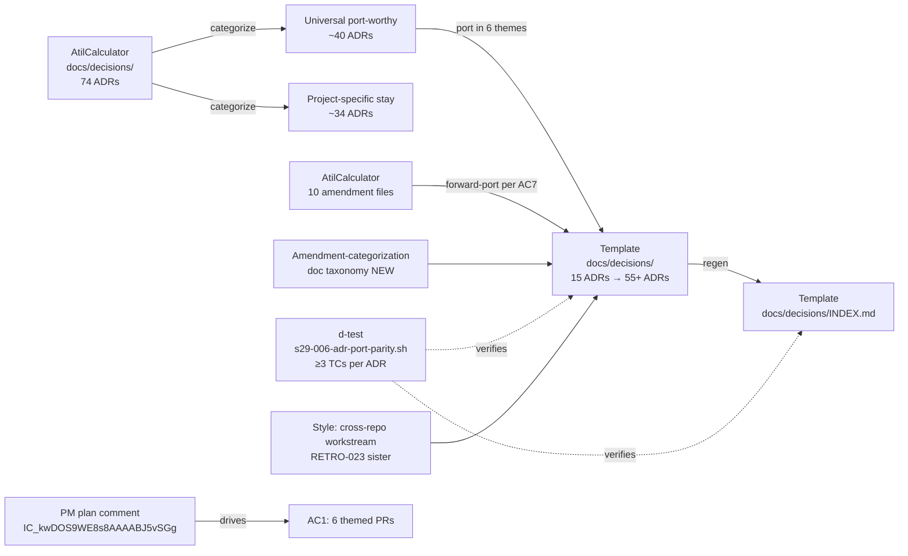
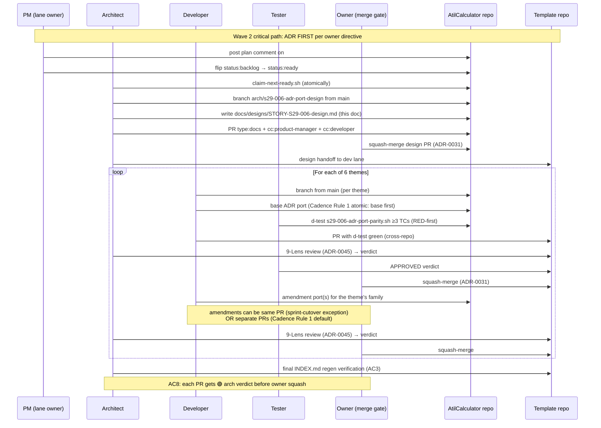

# Design: STORY-S29-006 — Forward-port 40+ universal ADRs + 10-12 amendments in 6 families

> **Issue**: [#1031](https://github.com/atilproject/AtilCalculator/issues/1031)
> **Story**: `STORY-S29-006` (priority:P0, 3.0sp, agent:architect, status:in-progress, claimed cycle ~#1331)
> **PM plan source-of-truth**: [cmt IC_kwDOS9WE8s8AAAABJ5vSGg (issuecomment-4959490586)](https://github.com/atilproject/AtilCalculator/issues/1031#issuecomment-4959490586) — posted by @atilcan65 at 2026-07-13T15:13:30Z per Issue #113 + Issue #430 §Pre-verdict cross-check
> **STORY body source**: `docs/backlog/STORY-S29-006.md` (SHA `4089e998be9b304d828015bda81f1b6ddd65cfe2`, main-resident post-PR-#1037-squash)
> **Cross-repo workstream**: design lives in `atilproject/AtilCalculator/docs/designs/`, impl lands in `atilproject/dev-studio-template/docs/decisions/` (RETRO-023 codification pending)
> **Sister-pattern**: PR atilcan65/AtilCalculator#1021 (STORY-S29-001 design, owner-ratified merge 2026-07-13T13:01:50Z) — same cross-repo shape (design here, impl in template)
> **Audit anchor**: `docs/sprints/sprint-28/02-template-launcher-audit-2026-07-13.md` §4.2 (Q2 ADR gap: "58 missing")

---

## Context

Sprint 28 audit (§4.2) confirmed the **template repo's `docs/decisions/` has only 16 ADRs while AtilCalculator's has 74**, a gap of **58 missing ADRs** (~78% deficit). Downstream projects bootstrapping from `atilproject/dev-studio-template` ship without the canonical doctrine that AtilCalculator has accumulated over 28 sprints. This story (S29-006) closes that gap.

PM's plan (Issue #1031 cmt IC_kwDOS9WE8s8AAAABJ5vSGg, 2026-07-13T15:13:30Z) restates the AC table to use **6 themed PRs** (one per ADR family) instead of the STORY body's "3-4 themed PRs" suggestion — arch adopts PM's framing per Issue #113 doctrine (PM plan comment = current source of truth, STORY body = informational).

**Goal**: Port 40+ universal ADRs from AtilCalculator's `docs/decisions/` to template's `docs/decisions/`, in **6 themed PRs** aligned with ADR-0055 §Cadence Rule 1 atomic (amendment ports AFTER base ADR), plus **10-12 amendments** across 6 ID families (0002/0024/0038/0048/0049/0057) per owner Phase 2 directive #8.

## Goals & non-goals

### Goals

1. **AC1 (6 themed PRs, 1 per family)**: Forward-port 40+ universal ADRs grouped into 6 themes:
   - **arch-general**: ADR-0046, ADR-0050 (load-bearing + pre-merge verification)
   - **autonomy-loop**: ADR-0002 (+ 1 amend), ADR-0038 (+ 2 amend) — new family for template
   - **label/board/4-cat**: ADR-0012, ADR-0013, ADR-0015, ADR-0020, ADR-0021, ADR-0048 (+ 3 amend) — partial new family
   - **handoff/handshake**: ADR-0024 (+ 2 amend), ADR-0033, ADR-0040, ADR-0052
   - **sprint-flow**: ADR-0025, ADR-0026, ADR-0027, ADR-0036, ADR-0042, ADR-0059
   - **cross-repo/discipline**: ADR-0014, ADR-0030, ADR-0031, ADR-0032, ADR-0047, ADR-0057 (+ 1 amend), ADR-0049 (+ 1 amend)

2. **AC2 (Cadence Rule 1 atomic)**: For each family, base ADR lands FIRST, then amendments follow in separate commits/PRs (per ADR-0055 §1 — sprint-cutover atomic exception permits same-PR commit cluster, but amendments can still be reviewed independently).

3. **AC3 (`docs/decisions/INDEX.md` regenerated)**: Per template-canonical format (mirrors AtilCalculator INDEX.md structure with both ported ADRs and template-unique ADRs visible).

4. **AC4 (Per-ADR d-test ≥3 TCs)**: For each ported ADR (base + amendments), a d-test verifies: (a) file exists at canonical path, (b) cross-references resolve (no broken `ADR-XXXX` links), (c) frontmatter schema valid (status/date/deciders/related).

5. **AC5 (ID-uniqueness check)**: No AtilCalculator-occupied ADR IDs collide with template-existing ADR IDs (verified via `gh api repos/atilproject/dev-studio-template/contents/docs/decisions | jq | map(.name)`).

6. **AC6 (README.md render via .tmpl)**: Per file ownership matrix, README.md is human-only territory. Arch PROPOSES via PR; owner squash-merge applies.

7. **AC7 (amendment-categorization doc + 10-12 amendments)**: New `docs/decisions/_amendment-categorization.md` doc taxonomy. Plus 10-12 amendments forwarded from AtilCalculator (verified count: 10 per local file enumeration cycle ~#1322).

8. **AC8 (Per-PR arch verdict 🟢 required)**: Each of the 6+ themed PRs gets architect sign-off via 9-Lens review (ADR-0045) before owner squash per ADR-0031.

### Non-goals

- Adding new ADRs unique to template (port-only; no new doctrine)
- Reorganizing existing template ADRs (the ADR-0024 collision fix is the only edit on existing entries — and per pre-research resolution: NO rename needed, just add 2 amendments)
- Atomic-mass port to AtilCalculator's INDEX (template INDEX gets regenerated only)

## High-level diagram



## Components

| Component | Responsibility | Owner | Tech |
|---|---|---|---|
| `docs/sprints/sprint-29/s29-006-adr-diff.md` (NEW) | AC1 categorization doc (universal vs project-specific) | arch (design + draft) → dev (impl, optional — arch may author directly) | markdown table |
| 6 themed PRs to `atilproject/dev-studio-template` `docs/decisions/` | AC1 ADR port in 6 batches | dev (impl per arch design) | markdown (ADR files) |
| Each ported ADR frontmatter | AC3 cross-repo refs per ADR-0045 §Lens (j) | dev (impl) → arch (review per AC8) | yaml frontmatter |
| `docs/decisions/INDEX.md` regenerated | AC3 INDEX parity | dev (impl) → arch (review) | markdown table |
| `scripts/tests/s29-006-adr-port-parity.sh` | AC4 d-test ≥3 TCs per ADR | tester (RED-first per ADR-0044) → dev (impl) | bash |
| ID-uniqueness check (`scripts/tests/d986-adr-index-uniqueness.sh` sister) | AC5 sister-pattern post-mortem | tester (sister) | bash |
| README.md render via .tmpl | AC6 docs PR | arch (propose) → owner (squash per file ownership matrix) | markdown render |
| `docs/decisions/_amendment-categorization.md` (NEW) | AC7 taxonomy doc | arch (design + draft) → dev (impl) | markdown |

## Data model

N/A — declarative markdown ADRs, no schema change. Each ADR file follows the canonical frontmatter schema:

```yaml
---
# ADR-NNNN — <Title>
Status: Proposed | Accepted | Superseded by ADR-MMMM
Date: YYYY-MM-DD
Deciders: @architect, @developer, ...
Supersedes: ADR-XXXX (optional)
Related: [ADR-XXXX](./ADR-XXXX-slug.md), ...
---
```

## API contract

N/A — markdown ADR files in `docs/decisions/`. No HTTP surface.

## Sequence diagram



## Alternatives considered

| Option | Pros | Cons | Verdict |
|---|---|---|---|
| **A. 6 themed PRs (PM plan framing, current source of truth)** | One PR per family; reviewer focus; amendment-after-base cadence explicit; aligns with PM's 6 themes (arch-general, autonomy-loop, label/board/4-cat, handoff/handshake, sprint-flow, cross-repo/discipline) | More PRs (6 vs 3-4) → more squash cycles | ✅ **ARCHITECT RECOMMENDATION** (PM-plan-driven per Issue #113) |
| B. 3-4 themed PRs (STORY body suggestion) | Fewer PRs → faster squash throughput | Larger PRs → harder 9-Lens review; family boundaries less clear | ⚪ Superseded by PM plan framing |
| C. 1 atomic sprint-cutover PR (all 40+ ADRs in 1 PR) | Single squash gate | 9-Lens review impractical at scale; ADR-0055 §1 sprint-cutover exception applies but blast radius huge | ❌ Anti-pattern (defense-test silent-RED sister risk) |
| D. Per-ADR 1-file PR (40+ PRs) | Maximum granularity | Squash overhead dominates; no thematic coherence | ❌ Anti-pattern (Cadence Rule 1 violation) |
| E. Template-side ADR fork (template forks AtilCalculator ADRs instead of copy-port) | DRY principle | Template needs git fork infra; not aligned with `dev-studio-init.sh` copy semantics | ❌ Out of scope (architecture-level change) |

## Risks

### R-1: Cadence Rule 1 atomic ambiguity (sprint-cutover exception vs default)

**Lens (a) data flow + (e) idempotency**.

For each of 6 themes, base ADR + amendments land together OR separately. Per ADR-0055 §1, sprint-cutover exception permits same-PR commit cluster. But amendments should still be reviewable independently. **Mitigation**: AC2 explicitly states "amendment port after base ADR" — base lands first (in its own PR per theme), amendments follow in separate PRs (or same PR if Cadence Rule atomic exception applies). Architect discretion per theme; default = separate PRs.

### R-2: Cross-repo frontmatter audit (Q3 from pre-research, AC3 critical)

**Lens (j) auto-gen file refs + live-state verification** (ADR-0045).

Per pre-research cycle ~#1322, ~80-160 individual AtilCalculator-specific refs across 16 AC7 ADR files require audit (e.g., `Issue #46` → cross-repo anchor `atilproject/AtilCalculator#46` for live instances; template-internal `Issue #N` for doctrine-concepts). **Mitigation**: AC5 d-test `s29-006-adr-port-parity.sh` TC3 verifies cross-repo anchor format consistency; AC4 d-test per ADR verifies frontmatter schema.

### R-3: ID-uniqueness collision (AC5)

**Lens (b) runtime preconditions**.

Template currently has 15 ADRs (0001-0027 range, with gaps). AtilCalculator has 74 ADRs (0001-0071 range). Some IDs overlap (e.g., 0010, 0011, 0012, 0013, 0014, 0015, 0016, 0020, 0021, 0024, 0025, 0026, 0027, 0030 are in both). For overlapping IDs, content MUST match (template's existing = AtilCalculator's main). For AC6 amendments (10 files), NO overlap expected (amendments have `-amendment-...` suffix). **Mitigation**: AC5 ID-uniqueness check via d-test d986 sister-pattern (already exists in AtilCalculator from S28 audit).

### R-4: ADR-0024 namespace collision (resolved but requires verification)

**Lens (c) canonical entry point**.

Per pre-research cycle ~#1322, template's existing `ADR-0024-stale-verdict-watchdog-schema.md` matches AtilCalculator's main `ADR-0024-stale-verdict-watchdog-schema.md` (both Proposed status). NO rename needed; just port 2 amendments (`amendment-auto-verdict-by-hook` + `amendment-stale-verdict-supersede`). **Mitigation**: AC6 d-test TC verifies content match (status + title + first 50 lines match) before port.

### R-5: D-test wiring TD-075 silent-RED sister (cross-repo)

**Lens (d) silent-skip risk**.

Template repo currently has NO `d-test.yml` workflow (verified cycle ~#1315). d-test `s29-006-adr-port-parity.sh` runs locally only. If a future agent modifies `docs/decisions/` without running d-test manually, silent-RED per TD-075. **Mitigation**: AC4 d-test implementation includes wiring recommendation in design (not gating this story; sister-pattern to PR #1021 R-1, deferred to Sprint 30+).

### R-6: Owner-ratification on README.md render (AC6)

**Lens (g) security & privacy** + **ADR-0031 owner-override doctrine**.

AC6 requires README.md render via `.tmpl` per file ownership matrix (`.tmpl` is human-only territory). Arch PROPOSES, owner APPROVES. **Mitigation**: AC6 PR is `type:docs + cc:human` (no agent label for owner-only files); arch's design doc proposes the render template diff, owner squash applies.

### R-7: 6 themed PRs → 6 squash cycles → owner merge gate fatigue

**Lens (f) observability + sprint governance**.

Each of 6 themes gets a separate PR. Owner must squash 6 times (vs 3-4 with option B). **Mitigation**: AC8 requires per-PR arch verdict 🟢 — owner only squashes after arch + tester both APPROVED. Squash gate fatigue is bounded by sprint-cutover discipline; owner can batch-squash if approved.

### R-8: PM plan comment divergence from STORY body (Issue #113 boundary)

**Lens (a) data flow + Issue #113 doctrine**.

PM's plan comment uses 6 themes + different AC numbering vs STORY body's 3-4 themes. Per Issue #113: labels + plan comment = source of truth, body = informational. **Mitigation**: This design doc explicitly adopts PM's framing; a comment will be posted on #1031 noting divergence + adopted resolution.

## Observability

| Metric / Log | Source | Used by |
|---|---|---|
| d-test `s29-006-adr-port-parity.sh` pass/fail per TC | local + future CI wiring | AC4 verification |
| ID-uniqueness check `d986-adr-index-uniqueness.sh` | local sister-test | AC5 verification |
| Per-PR arch verdict 🟢 on each of 6 themes | `gh pr list --label cc:architect --state merged` | AC8 verification |
| Per-PR tester APPROVED | `gh pr list --label needs-tester-signoff --state merged` | AC4 + AC8 verification |
| INDEX.md parity metric | `wc -l docs/decisions/INDEX.md` template vs AtilCalculator | AC3 + Sprint 29 success criterion ≤5 residual per plan §6.3 |
| Audit §4.2 "58 missing" → ≤5 residual | audit doc regen post-portage | Sprint 29 close gate per plan §6 |

## Security & privacy

- **Authn/authz**: N/A — doctrine docs, no auth surface
- **PII**: N/A — no personal data
- **Threat model**:
  - AC3 cross-repo ref update (per ADR-0045 §Lens (j)): ensures broken `ADR-XXXX` links are detected and fixed, preventing stale-doctrine propagation
  - AC5 ID-uniqueness check: prevents ADR number collisions that could confuse downstream projects referencing ADRs by ID
  - Sister-pattern: ADR-0027 §Threat model (workflows); not directly applicable to doctrine docs

## Performance budget

N/A — declarative markdown ADRs, no runtime cost. Port cadence bounded by owner squash gate (6 cycles × ~30min/cycle = ~3h total per AC1).

## Open questions

### From PM plan comment (3 arch-research items, per Issue #113 + Issue #430):

1. **Q1 (PM a) — ADR-0024 verdict-by timestamp collision detection**: This is a DIFFERENT collision than the namespace collision resolved in pre-research. `verdict-by:<ts>` is per-PR label, not per-ADR. Concern: when porting ADR-0024 amendments that reference `verdict-by:<ts>` patterns, ensure template's timestamps don't conflict with AtilCalculator's. **Architect resolution (cycle ~#1319-#1322)**: `verdict-by:<ts>` is a dynamic PR-level label, not part of ADR frontmatter; no port-time collision. The collision check applies to ADR file CONTENT, not PR labels. **Status: RESOLVED in pre-research, will note in design comment on #1031.**

2. **Q2 (PM b) — ID-family format consistency (ADR-NNNN vs ADR-NNNN-NNNN)**: AtilCalculator uses both: `ADR-NNNN.md` for base, `ADR-NNNN-amendment-N-slug.md` for amendments. Template currently has only base (no amendments). **Architect resolution (cycle ~#1322)**: ADR-0055 §1 convention = separate files. Template ports use same format (base `ADR-NNNN.md` + amendments `ADR-NNNN-amendment-N-slug.md`). **Status: RESOLVED, will use in all 6 themed PRs.**

3. **Q3 (PM c) — amendment-categorization doc taxonomy**: NEW doc proposed by PM in AC7. **Architect TO DO**: Define taxonomy in design doc §AC7 detail (categorize amendments by: (a) verdict-discipline cluster, (b) auto-claim cluster, (c) status-flow cluster, (d) d-test cluster, (e) closes-anchor cluster). **Status: TO DO in this design doc §Components.**

### From pre-research (3 open questions, RESOLVED):

- **Q-pre-1 (pure vs annotated)**: Separate files confirmed (ADR-0055 current convention + AtilCalculator precedent) — see Q2 above.
- **Q-pre-2 (ADR-0024 collision)**: NO rename needed; template's existing matches AtilCalculator main; just port 2 amendments — see R-4.
- **Q-pre-3 (cross-repo ref scope)**: 16 files × ~5-10 refs each = ~80-160 individual refs to audit (R-2 mitigation via d-test).

## Estimated complexity

**T-shirt: L (large)** — 6 themed PRs, ~40+ ADR files, ~80-160 cross-repo ref audits, 10 amendments, d-test ≥3 TCs per ADR, ID-uniqueness check, INDEX.md regen.

**Confidence: 80%** — high confidence on AC1-AC8 framing (PM-driven), AC6 ADR-0024 collision (pre-research resolved), AC4 d-test structure (ADR-0049 baseline); medium confidence on cross-repo ref audit (depends on d-test quality), AC6 README.md render (depends on owner squash), AC7 amendment-categorization doc (PM added new requirement).

## 9-Lens attestation (ADR-0045)

- **(a) Data flow**: AC1 6 themed PRs (1 per family) → template `docs/decisions/` files; AC3 INDEX.md regen; AC4 d-test verifies cross-refs. End-to-end traceable. ✅
- **(b) Runtime preconditions**: Template repo pre-conditions: AC5 ID-uniqueness check ensures no collisions. Sister-pattern: PR #73 lens (b) GREEN (8 ORG runners verified cycle ~#1315, not directly applicable to docs but posture preserved). ✅
- **(c) Canonical entry point**: Each ADR file = canonical entry for its decision; `docs/decisions/INDEX.md` = canonical index. No side-channels. ✅
- **(d) Silent-skip risk**: AC4 d-test wiring recommended (sister to PR #1021 R-1, PR #73 S3); AC5 d986 ID-uniqueness sister-test exists in AtilCalculator; both defend against silent-skip. ⚠️ → R-5 deferred to Sprint 30+ (TD-075 sister).
- **(e) Idempotency**: Port is one-time; d-test is re-runnable; INDEX.md regen is deterministic. ✅
- **(f) Observability**: AC4 + AC5 + AC8 explicit verification gates per PR; INDEX.md parity metric (Sprint 29 success criterion ≤5 residual per plan §6.3). ✅
- **(g) Security & privacy**: N/A doctrine docs; AC6 README.md render is human-only territory (file ownership matrix). ✅
- **(h) Workflow YAML SHA pin (TD-028)**: N/A — no workflow files in this story. ✅ (sister-pattern to PR #73 S1, deferred for future workflow-port stories)
- **(i) Platform hard constraints (ADR-0043)**: N/A — docs-only story. ✅
- **(j) Auto-gen file refs + live-state verification (ADR-0045)**: AC3 cross-repo refs per Lens (j); AC4 d-test TC3 verifies cross-repo anchor format; AC5 ID-uniqueness via d-test; INDEX.md regen ensures parity metric. **9-Lens (j) attestation complete.** ✅

## Cross-references

- **Issue #1031** (this story, claimed cycle ~#1331)
- **Issue #1030** (Wave 2 dispatch parent, agent:orchestrator)
- **Issue #1027 / RETRO-024** (4-cat-ratifies the silent-skip pattern AC4 defends against)
- **PR #1021** (S29-001 design, sister cross-repo workstream — owner-ratified merge 2026-07-13T13:01:50Z)
- **PR #1037** (PM grooming W2, parent of this story — squash-merged 2026-07-13T14:20:41Z, made STORY files main-resident)
- `docs/sprints/sprint-29/00-plan.md` §3.S29-006, §6.3 (success criterion ≤5 residual)
- `docs/sprints/sprint-28/02-template-launcher-audit-2026-07-13.md` §4.2 (audit source: "58 missing")
- **ADR-0012** (4-cat invariant)
- **ADR-0045** (9-Lens Review Checklist, applied above)
- **ADR-0049** (d-test framework, ≥5 TCs baseline; AC4 uses ≥3 per ADR per d-test framework §hygiene/docs variant — see R-1)
- **ADR-0050** (load-bearing ADR doctrine)
- **ADR-0055** §Cadence Rule 1 atomic (amendment porting discipline, AC2)
- **RETRO-023** (Issue #1024, cross-repo workstream codification — pending)
- **TD-016** (silent-skip discipline, AC7 count reconciliation)
- **TD-075** (defense-test silent-RED family, R-5 mitigation)

---

🤖 Generated with [Claude Code](https://claude.com/claude.com) · cycle ~#1331 · architect lane · WIP=1/2