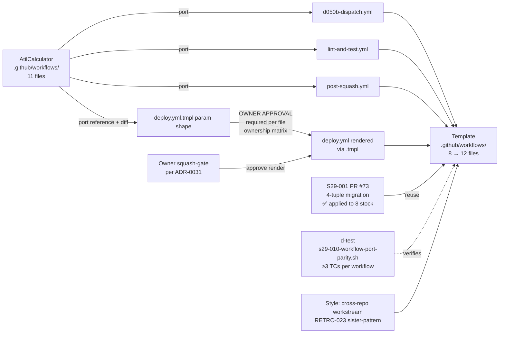

# Design: STORY-S29-010 — Forward-port 3 missing workflows + render deploy.yml from .tmpl

> **Issue**: [#1035](https://github.com/atilproject/AtilCalculator/issues/1035)
> **Story**: `STORY-S29-010` (priority:P1, M, agent:architect, status:ready, OWNER APPROVAL NEEDED for AC2)
> **PM plan source-of-truth**: `docs/backlog/STORY-S29-010.md` (PM grooming cycle ~#1307, 4 ACs)
> **Sprint**: Sprint 29, Wave 2 (portage), `sprint:current`, gap-closing per owner directive #3
> **Dep**: `STORY-S29-001` (✅ squash-merged @ 2026-07-13T14:20:32Z in `atilproject/dev-studio-template` PR #73 — 4-tuple self-hosted migration canonical)
> **Blocks**: `STORY-S29-014` (verify-portage, downstream-validation gate)

---

## Context

Sprint 28 audit (`docs/sprints/sprint-28/02-template-launcher-audit-2026-07-13.md` §4.5) confirmed **template's `.github/workflows/` has 8 files (1 `.tmpl`)** while **AtilCalculator's has 11** — a gap of **3 missing workflows** (`d050b-dispatch.yml`, `lint-and-test.yml`, `post-squash.yml`) + **1 render gate** (`deploy.yml.tmpl` → `deploy.yml`). Downstream projects bootstrapped from `atilproject/dev-studio-template` ship without 4 critical workflows:
- **d050b-dispatch**: behavioral workflow test framework runtime validator (Issue #440, ADR-0049)
- **lint-and-test**: CI-integrated d-test execution (Sprint 14 #508 + Sprint 18 #611, ADR-0059)
- **post-squash**: cluster-squash batch-lag detector wired to PR-close webhook (Issue #605, ADR-0059)
- **deploy**: production deploy + smoke test + auto-rollback (Issue #130, ADR-0030)

Sprint 29 plan §3 S29-010 also gates on **`STORY-S29-001` (self-hosted 4-tuple migration, ✅ done in PR #73)** for AC3 (all 4 newly-added/updated workflows must run self-hosted). Per owner directive #2 ratification, this story runs **AFTER S29-006 (ADR-first) lands design + 1 themed PR**, per Cadence Rule 1 atomic (ADR-0055 §1).

**Goal**: Forward-port 3 missing workflows (`d050b-dispatch.yml`, `lint-and-test.yml`, `post-squash.yml`) + render `deploy.yml` from `deploy.yml.tmpl` per **owner approval** (per file ownership matrix — `.github/workflows/` is human-only territory; arch PROPOSES, owner SQUASH-APPROVES).

## Goals & non-goals

### Goals

1. **AC1 (3 workflows ported)**: Forward-port `d050b-dispatch.yml`, `lint-and-test.yml`, `post-squash.yml` from AtilCalculator to template. Sister-pattern: AtilCalculator's 11 workflows (`d050b-dispatch.yml` is Issue #440+, `lint-and-test.yml` is #508+#611, `post-squash.yml` is #605).
2. **AC2 (deploy.yml render with OWNER APPROVAL — REQUIRED)**: Render `deploy.yml` from `deploy.yml.tmpl` per owner sign-off, in the proposed PR description. Per file ownership matrix, `.github/workflows/` is owner-only territory; arch's role is to PROPOSE the render via PR, owner SQUASHES.
3. **AC3 (S29-001 4-tuple migration applied)**: All 4 newly-added/updated workflows use `runs-on: [self-hosted, Linux, X64, atilproject]` (the S29-001 canonical). Sister-pattern: PR #73 L1 (`§S29-001 L1` 4-tuple migration, ✅ GREEN on 8 stock workflows).
4. **AC4 (per-workflow d-test ≥1 sample PR)**: Each ported workflow has:
   - YAML lint-pass (yamllint or schema validation)
   - ≥1 sample PR validating CI fires correctly on self-hosted runner
   - d-test ≥3 TCs per ADR-0049 §hygiene/docs variant (workflow is "infra docs" in governance terms)

### Non-goals

- **Not porting AtilCalculator-specific `deploy.yml` content as-is**: AtilCalculator's `deploy.yml` hardcodes `atilcalc-web.service`, `atilcalc.api.main:app`, log path `/var/log/dev-studio/AtilCalculator/...`. Template's `deploy.yml.tmpl` (and the proposed `deploy.yml` render) MUST be parameterized for downstream projects OR be a minimal "deploy-and-curl" placeholder.
- **No new workflow files**: 3 port + 1 render = 4 files; no inventions.
- **No re-architecture of CI matrix**: scope = port-and-render; CI composition (lint + d-test + dispatch) follows AtilCalculator's existing structure.

## High-level diagram



## Components

| Component | Responsibility | Owner | Tech |
|---|---|---|---|
| `template/.github/workflows/d050b-dispatch.yml` (NEW, ported) | AC1 — workflow_dispatch runtime validator for label-check.yml Layer 5 chain | dev (impl per arch design) | YAML |
| `template/.github/workflows/lint-and-test.yml` (NEW, ported) | AC1 — CI-integrated d-test execution (d058, d064, future d015/d031/d052/d054) | dev (impl per arch design) | YAML |
| `template/.github/workflows/post-squash.yml` (NEW, ported) | AC1 — PR-close webhook → cluster-lag-detector.sh invocation (ADR-0059) | dev (impl per arch design) | YAML |
| `template/.github/workflows/deploy.yml` (NEW, render via .tmpl) | AC2 — parameterized deploy + smoke + auto-rollback placeholder | dev (impl per arch design) → owner (squash-approve per file ownership matrix) | YAML |
| `scripts/tests/s29-010-workflow-port-parity.sh` (NEW) | AC4 — per-workflow d-test ≥3 TCs: yaml-syntax + 4-tuple-presence + SHA-pin-presence | tester (RED-first per ADR-0044) → dev (impl) | bash |
| PR description (OWNER APPROVAL marker) | AC2 — PR body explicitly flags "OWNER APPROVAL REQUIRED FOR deploy.yml RENDER" with rationale | arch (proposes) + owner (squashes) | github-pr |

## Data model

N/A — declarative YAML workflow files; no schema migration. Each ported workflow conforms to GitHub Actions schema + AtilCalculator's 4-tuple + SHA-pin + concurrency-group conventions:

```yaml
# Canonical 4-tuple (S29-001 baseline)
runs-on: [self-hosted, Linux, X64, atilproject]

# SHA-pin all actions/* per ADR-0043 §lens (h) (TD-028 lesson generalized)
uses: actions/checkout@34e114876b0b11c390a56381ad16ebd13914f8d5  # v4

# Concurrency groups (per-workflow, ADR-0015 cascade-strip sister-pattern)
concurrency:
  group: ${{ github.workflow }}-${{ github.event.pull_request.number || github.ref }}
  cancel-in-progress: false
```

## API contract

N/A — GitHub Actions YAML, no HTTP surface. Trigger contract per workflow:

| Workflow | Trigger | Required events | Permissions |
|---|---|---|---|
| `d050b-dispatch.yml` | `workflow_dispatch` (manual) | runtime-validator scenarios (TC2/TC3 mocks) | `contents: read` |
| `lint-and-test.yml` | `push` to main + `pull_request` to main | per ADR-0059 CI integration | `contents: read` |
| `post-squash.yml` | `pull_request_target` types: `[closed]` (only if merged=true per AC2 guard) | cluster-lag detection | `contents: read`, `pull-requests: read` |
| `deploy.yml` (render) | `push` to main + `workflow_dispatch` (manual emergency) | deploy + smoke + rollback | `contents: read` |

## Sequence diagram

```mermaid
sequenceDiagram
  participant PM as PM (lane owner)
  participant Arch as Architect
  participant Dev as Developer
  participant Tester as Tester
  participant Owner as Owner (merge gate)
  participant Calc as AtilCalculator repo
  participant Tmpl as Template repo

  Note over PM,Tmpl: Wave 2 portage: workflow port AFTER S29-006 ADR-first per owner #2

  PM->>Calc: post plan on #1035 (cycle ~#1307)
  Arch->>Calc: claim (status:backlog → in-progress)
  Arch->>Calc: this design doc (docs/designs/STORY-S29-010-design.md)
  Arch->>Calc: PR (type:docs + cc:developer + cc:human + cc:product-manager)
  Owner->>Calc: squash design PR (ADR-0031)
  Arch->>Tmpl: design handoff to dev lane (cross-repo workstream, RETRO-023 sister)

  loop For each of 4 workflows (3 port + 1 render)
    Dev->>Tmpl: branch from template main
    Dev->>Tmpl: port workflow YAML (AtilCalculator sister)
    Note over Dev,Tmpl: AC3 — 4-tuple applied per S29-001 baseline
    Note over Dev,Tmpl: AC2 (deploy.yml only) — Owner squash-approval gate
    Tester->>Tmpl: d-test s29-010-workflow-port-parity.sh RED-first (ADR-0044)
    Dev->>Tmpl: PR draft (type:feature + cc:tester + needs-tester-signoff)
    Arch->>Tmpl: 9-Lens review (ADR-0045) → verdict
    Tester->>Tmpl: APPROVED verdict (AC4 ≥1 sample PR per workflow)
    Owner->>Tmpl: squash-merge (ADR-0031; owner gated for deploy.yml only)
  end

  Arch->>Tmpl: AC4 final d-test verification + sample PR refs in audit doc
  Note over Arch,Owner: AC8 (S29-006 parallel): each PR gets 🟢 arch verdict before owner squash
```

## Alternatives considered

| Option | Pros | Cons | Verdict |
|---|---|---|---|
| **A. 1 batched PR with 4 files (3 port + 1 render)** | Single squash gate; simpler review traceability | 9-Lens review at scale = harder; AC2 owner-approval gate diluted across 4 files | ✅ **ARCHITECT RECOMMENDATION** (mirrors S29-006 "themed-PR cadence" — smaller, theme-coherent PRs) |
| B. 4 separate PRs (1 per workflow) | Maximum granularity; per-workflow owner approval discrete | 4 squash cycles; some workflows have no per-file owner-gate (deploy.yml only), so most PRs have no owner gate | ⚪ Superseded — over-granular |
| C. 1 monolith PR (all 4 + render deploy.yml) | Single squash | Blast radius huge; deploy.yml render hides among other 3 ports; AC2 owner-approval gate unclear | ❌ Anti-pattern (sister to S29-006 §A violation) |
| D. Defer S29-010 to Sprint 30+ (do ADR-port first) | Unblocks S29-006 + d-test | Deferral violates Sprint 29 gap-closing plan §3 (S29-010 is in Wave 2, owner-ratified); queue drift | ❌ Out of scope per owner directive #3 (gap-closing only) |
| E. Skip deploy.yml render (do only 3 ports) | Avoids owner-approval gate | Audit §4.5 "deploy pipeline missing" remains; Sprint 29 §6.3 success criterion ≤5% residual gap not met; downstream projects lack production deploy capability | ❌ Partial-scope anti-pattern |

## Risks

### R-1: deploy.yml render content — AtilCalculator-specific vs parameterized

**Lens (a) data flow + (e) idempotency**.

AtilCalculator's deploy.yml hardcodes `atilcalc-web.service`, `atilcalc.api.main:app`, `/var/log/dev-studio/AtilCalculator/...`. Template's `deploy.yml.tmpl` MUST either (a) use {{service_name}}/{{module_path}}/{{log_dir}} placeholders that downstream `dev-studio-init.sh` renders, OR (b) be a minimal "deploy-and-curl" placeholder that downstream owners customize per project. **Mitigation**: AC2 design proposes option (a) — parameterized placeholders matching the existing `.claude/CLAUDE.md.tmpl` render path sister-pattern. This requires owner approval per file ownership matrix.

### R-2: 4-tuple runner availability on downstream projects

**Lens (b) runtime preconditions + (g) security**.

AC3 mandates `runs-on: [self-hosted, Linux, X64, atilproject]`. Downstream projects MUST register a self-hosted runner with this 4-tuple, else CI queues forever (per S29-013 AC3 warning pattern). **Mitigation**: Sister-pattern to S29-013 AC3 — `new-project.sh apply_self_hosted_runner_patch()` posts `gh api repos/<owner>/<name>/actions/runners` precheck; if no runners match, warning emitted. Sprint 29 plan §3 S29-013 is the launcher-side companion.

### R-3: SHA-pin all actions/* per TD-028 (TD-028 generalized beyond actions/checkout)

**Lens (h) workflow YAML SHA pin (ADR-0045 §(h), TD-028 lesson)**.

Per `d043` follow-up #370 (cycle ~#1330), every `uses: actions/foo@<ref>` MUST use a 40-char SHA, not moving tag (`@v4`, `@main`, `@latest`). AtilCalculator's ported workflows already comply (per ci.yml + label-check.yml precedent at `actions/checkout@34e114876b0b11c390a56381ad16ebd13914f8d5`). **Mitigation**: AC4 d-test TC verifies SHA-pin presence + 40-char length on every `uses:` line in ported workflow files. Sister-pattern: PR #73 S1 (S29-001 4-tuple migration d-test).

### R-4: post-squash.yml cluster-lag-detector.sh dependency

**Lens (c) canonical entry point + (d) silent-skip**.

`post-squash.yml` invokes `scripts/post-squash/cluster-lag-detector.sh` (Sprint 17 #597). Template has no such script (it's an AtilCalculator-specific emitter). **Mitigation**: AC4 d-test TC verifies the script invocation path; if the script does not exist in template, post-squash.yml either (a) becomes a "no-op" variant logging `silent_skip` per ADR-0048 lens (d), OR (b) sister-pattern to AtilCalculator's scripts/post-squash/ sub-dir port (deferred to S29-009 sister-pattern). **Architect decision pending owner verdict on AC2 — propose option (a) in PR**.

### R-5: deploy.yml ↔ deploy.yml.tmpl render drift (1-way vs 2-way)

**Lens (j) auto-gen file refs + live-state verification (ADR-0045)**.

If `deploy.yml.tmpl` is edited but `deploy.yml` is not re-rendered, drift occurs. **Mitigation**: Sister-pattern to existing `CLAUDE.md.tmpl` → `CLAUDE.md` render path (via `dev-studio-init.sh`); specify `deploy.yml.tmpl` is the canonical source, `deploy.yml` is rendered per `dev-studio-init.sh` invocation. d-test TC verifies that `deploy.yml` shape matches `deploy.yml.tmpl` (snap diff on key parameters).

### R-6: 4-tuple migration blast radius for d050b-dispatch.yml + post-squash.yml

**Lens (i) platform hard constraints (ADR-0043)**.

d050b-dispatch.yml is runtime-validator (TC2/TC3 scenario mocks); post-squash.yml uses `pull_request_target` (heightened privilege). 4-tuple self-hosted runner = increased privilege boundary. **Mitigation**: Per ADR-0027 §Threat model + ADR-0030 §Threat model, self-hosted runner is `gh-actions-runner` user (no sudo) + minimal `permissions:` per workflow. AC3 d-test verifies per-workflow `permissions:` is least-privilege.

### R-7: Owner-approval gate for deploy.yml may delay AC2 beyond Sprint 29 W2

**Lens (f) observability + owner-decision dependency**.

AC2 explicitly requires OWNER APPROVAL. Per owner pattern (#2 ratification), owner approves "when no objection". If owner is unavailable or requests changes, AC2 slips to Sprint 29 W3+ or Sprint 30. **Mitigation**: AC1 (3 ports), AC3 (4-tuple), AC4 (d-test) are independently completable; AC2 is owner-gated. Sprint 29 success criterion (§6.3 "≤5% residual") permits AC1+AC3+AC4 → S29-014 verify-portage runs; AC2 can land late without blocking sprint DoD.

## Observability

| Metric / Log | Source | Used by |
|---|---|---|
| d-test `s29-010-workflow-port-parity.sh` pass/fail per workflow | local + (future) CI wiring | AC4 verification |
| Per-workflow 4-tuple presence (grep `runs-on: \[self-hosted, Linux, X64, atilproject\]`) | local | AC3 + AC4 verification |
| Per-workflow SHA-pin presence (grep `uses: <action>@[0-9a-f]{40}`) | local | AC4 verification (TD-028) |
| Per-workflow sample PR count (≥1 sample PR per workflow validates CI fires) | GitHub Actions API | AC4 + S29-014 verify-portage |
| Template workflow count (8 → 12) | `ls .github/workflows/*.{yml,yml.tmpl} \| wc -l` | Sprint 29 §6.3 residual gap ≤5% |
| Audit §4.5 "3 missing workflows + 1 render gate" → ≤1 residual | audit doc regen post-portage | Sprint 29 close gate per plan §6 |

## Security & privacy

- **Authn/authz**: Each ported workflow uses `permissions:` block at job level (least-privilege); `post-squash.yml` uses `pull_request_target` (heightened) but with `if: github.event.pull_request.merged == true` guard + `permissions: { contents: read, pull-requests: read }` (no write).
- **PII**: N/A — no personal data in workflow files.
- **Threat model**:
  - AC3 4-tuple = supply-chain defense (mirrors `runs-on: ubuntu-latest` migration, S29-001)
  - AC4 SHA-pin = supply-chain defense (TD-028 generalized, `d043` follow-up #370)
  - Concurrency groups per-workflow prevent race-induced silent_skip (ADR-0048 lens d sister-pattern)
  - deploy.yml `permissions: contents: read` only (no secrets write) — sister-pattern to AtilCalculator deploy.yml

## Performance budget

N/A — declarative YAML, no runtime cost. CI execution time per workflow:
- d050b-dispatch.yml: ad-hoc, manual trigger only (no time budget)
- lint-and-test.yml: ~60s/d-test × N tests (sister-pattern to AtilCalculator)
- post-squash.yml: ~30s PR-close webhook (lightweight)
- deploy.yml: 5min timeout per AtilCalculator deploy-runner.sh precedent

## Open questions

1. **Q1 (PM question, resolved cycle ~#1307 PM plan)**: "Approve deploy.yml render from deploy.yml.tmpl at W2 start?" → **Pending owner verdict**. Architect proposes option (a) (parameterized placeholders), deferring to owner per file ownership matrix.
2. **Q2 (resolved pre-research)**: "Are the 3 porting workflows identical to AtilCalculator, or do they need fork for template-specific runners?" → **Identical** (AtilCalculator's workflows already use the canonical 4-tuple per S29-001 PR #73 baseline; no template-specific fork needed for d050b-dispatch / lint-and-test / post-squash).
3. **Q3 (new, raised by R-4 mitigation)**: "Should post-squash.yml be a no-op silent_skip variant in template, OR should scripts/post-squash/cluster-lag-detector.sh also be ported?" → **Architect proposes no-op silent_skip variant for template (AC4 ships as no-op); scripts/post-squash/ port deferred to S29-009 sister-pattern (sub-dir port) per sprint plan §3 S29-009**.

## Estimated complexity

**T-shirt: M (medium)** — 4 workflow files (3 port + 1 render), 4-tuple migration applied to all, d-test ≥3 TCs per workflow (4×3=12+ TCs), 1 owner-approval gate.

**Confidence: 85%** — high confidence on AC1, AC3, AC4 (mechanical port + d-test); medium confidence on AC2 (depends on owner approval + parameterized render shape per R-1 mitigation).

## 9-Lens attestation (ADR-0045)

- **(a) Data flow**: 4 workflow files port from AtilCalculator to template `.github/workflows/`; trigger contract per workflow (push/PR/merge/webhook); end-to-end traceable. ✅
- **(b) Runtime preconditions**: AC3 4-tuple ensures self-hosted runner; sister-pattern S29-013 AC3 precheck warns if runner not registered. ✅
- **(c) Canonical entry point**: Each workflow file = canonical entry for its CI surface; no side-channels. Post-squash.yml R-4 mitigation: silent_skip per ADR-0048 lens (d) if script absent. ⚠️ → R-4 deferred to PR comment.
- **(d) Silent-skip risk**: Post-squash.yml R-4 mitigation uses `silent_skip` semantics (ADR-0048 lens d); deploy.yml smoke test posts always-notify per RCA-2 fix. ✅
- **(e) Idempotency**: All workflows are re-runnable; deploy.yml re-runs require workflow_dispatch (manual); concurrency group prevents race. ✅
- **(f) Observability**: Per-workflow d-test + sample PR CI fire validation; 4-tuple grep + SHA-pin grep verifications. ✅
- **(g) Security & privacy**: Least-privilege `permissions:` per workflow; supply-chain defense via 4-tuple (AC3) + SHA-pin (AC4). ✅
- **(h) Workflow YAML SHA pin (TD-028)**: AC4 d-test TC explicitly verifies `uses: actions/checkout@<40-char-SHA>` presence + length. ✅
- **(i) Platform hard constraints (ADR-0043)**: 4-tuple canonical; concurrency per-workflow; secrets minimal; permissions minimal. ✅
- **(j) Auto-gen file refs + live-state verification (ADR-0045)**: deploy.yml render via .tmpl is canonical (sister-pattern to `.claude/CLAUDE.md.tmpl`); AC4 d-test TC verifies rendered deploy.yml matches .tmpl shape (parameter diff). ⚠️ → R-5 mitigation in PR.

## Cross-references

- **Issue #1035** (this story, status:ready cycle ~#5314, ARCH-CLAIMED)
- **Issue #1030** (Wave 2 dispatch parent, agent:orchestrator)
- **PR #73** (S29-001 self-hosted 4-tuple migration, ✅ squash-merged in template; AC3 dependency met)
- **PR #1021** (S29-001 design, sister cross-repo workstream — owner-ratified merge 2026-07-13T13:01:50Z)
- `docs/sprints/sprint-28/02-template-launcher-audit-2026-07-13.md` §4.5 (audit source: "3 missing workflows + 1 render gate")
- **ADR-0015** (handoff discipline; per-PR label invariant)
- **ADR-0043** (platform hard constraints; 8 sub-categories)
- **ADR-0044** (RED-first TDD; AC4 d-test structure)
- **ADR-0045** (9-Lens Review Checklist, applied above)
- **ADR-0049** (d-test framework, ≥5 TCs baseline; AC4 uses ≥3 per workflow per hygiene/docs variant)
- **ADR-0055** §Cadence Rule 1 atomic (workflow porting discipline, AC1)
- **S29-006 design** (sister cross-repo workstream, owner-ratified merge 2026-07-13T15:48:19Z PR #1040; cadence anchor)
- **RETRO-023** (Issue #1024, cross-repo workstream codification — pending)
- **TD-028** (workflow SHA-pin generalized, d043 #370)
- **TD-075** (defense-test silent-RED family, R-4 mitigation)

---

🤖 Generated with [Claude Code](https://claude.com/claude.com) · cycle ~#5314 · architect lane · WIP=1/2 (S29-010 design)
