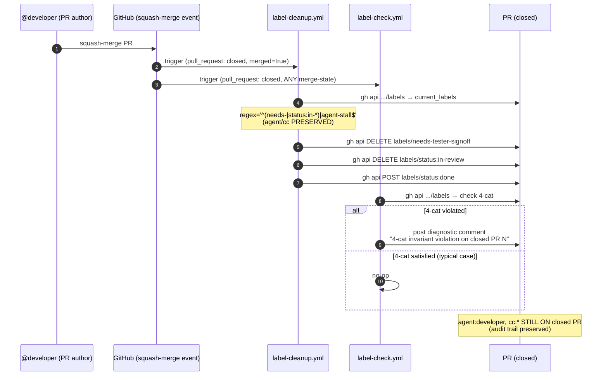
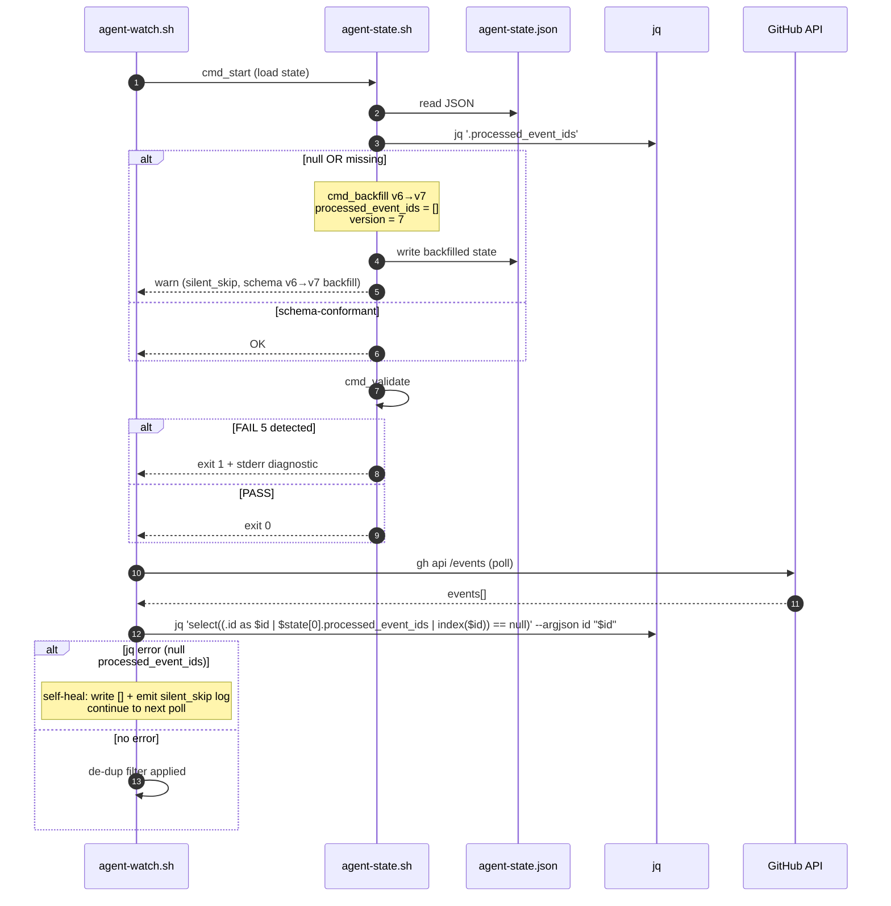

# Design: TD-067 + TD-068 Sister-Pattern Fix — Post-Merge Label-Strip + Agent-State v6→v7 Backfill

> **Doctrinal home:** Issue #920 (TD-068) + Issue #922 (TD-067) — sister-pattern "post-action invariant break" failures on orthogonal axes (PR-axis vs state-file-axis).
> **Sprint scope:** Sprint 24+ per @orchestrator defer-directive superseded by empirical-repro + tester dual-review offer.
> **Tester d-test pattern:** combined review per @tester offer in cmt 4923106350 + 4923610102.
> **Closes:** Issue #920 (TD-068), Issue #922 (TD-067). Refs RETRO-016 (post-verdict cross-watchdog sister-pattern lineage).

---

## Context

Two bugs filed same sprint cluster (cycle ~1222), both empirically reproduced by tester this session:

- **TD-067 #922** — `.github/workflows/label-cleanup.yml` strips `agent:*` + `cc:*` + `needs-*` labels on `pull_request: closed` event. Empirical evidence (PR #918 + #919 post-merge REST queries): agent + cc labels lost, type/status/verdict-by labels survive. **Architectural intent was "transient cleanup" per stale ADR-0007 reference**; operational consequence is 4-cat invariant violation + loss of pr_labeled wake on closed PRs (the wake mechanism ADR-0009 § 10.3 + ADR-0038 depend on for audit).

- **TD-068 #920** — `scripts/agent-state.sh` v6→v7 schema migration does not backfill `processed_event_ids`. A null value (from legacy state files or external hand-edit) causes `scripts/agent-watch.sh:1929` `select((.id as $id | $state[0].processed_event_ids | index($id)) == null)` to fail with `Cannot index null with null`, which the watcher silently swallows (exit 0, no log). `cmd_validate` mis-diagnoses NULL as "empty" (FAIL 3) instead of schema-mismatch (FAIL 5).

These are **sister-pattern** because both are post-action invariant breaks on orthogonal axes:
- TD-067 = GitHub-PR-axis (the label invariant on a PR after squash-merge)
- TD-068 = state-file-axis (the de-dup invariant on a watcher after schema migration)

Both have the same failure shape: a documented invariant is violated silently by an action that "should" preserve it.

---

## Goals & non-goals

### Goals

1. **TD-067 fix** — Preserve `agent:*` + `cc:*` labels through squash-merge, restoring 4-cat invariant on closed PRs (ADR-0012 + ADR-0031 owner-merge-gate audit trail).
2. **TD-068 fix** — `agent-state.sh` v6→v7 backfill handles null `processed_event_ids`; `cmd_validate` correctly diagnoses NULL as schema corruption; watcher self-heals on jq error.
3. **Combined review** — Both fix-PRs ship in same cycle, tester reviews back-to-back.
4. **No regression** — All existing label-cleanup behavior on `issues: closed` preserved (per ADR-0007 stale-doctrine intent: keep cc/agent transient OFF PRs but DON'T strip on PRs is the fix).
5. **Defense in depth** — New regression test suite (≥5 TCs per ADR-0049) covers both bugs.

### Non-goals

- ❌ Generalize the post-merge label-preserve to `issues: closed` (issues don't have agent/cc ownership labels).
- ❌ Refactor `label-cleanup.yml` beyond the surgical label-list change (out of scope; Sprint 25+).
- ❌ Add CRDT/coordinated state-store for processed_event_ids — local file is sufficient per scale (≤1 event/30s typical).
- ❌ Re-issue any prior peer verdicts — both bugs were caught in same sprint, no historical drift.

---

## High-level diagram

```mermaid
flowchart LR
    subgraph TD-067 [PR-axis: post-merge label-strip]
      A[PR squash-merged] --> B[label-cleanup.yml trigger<br/>pull_request: closed]
      B --> C{New logic:<br/>only strip needs-* + agent-stall}
      C -->|agent:* / cc:*| D[Preserved on closed PR]
      C -->|needs-* / agent-stall| E[Removed]
      C -->|status:in-* | F[status:done]
    end

    subgraph TD-068 [state-file-axis: schema backfill]
      G[legacy agent-state.json<br/>processed_event_ids=null] --> H[agent-state.sh start]
      H --> I{cmd_backfill v6→v7}
      I -->|missing field| J[add [], schema v7]
      I -->|null field| J
      J --> K[watcher reads schema-conformant state]
      K --> L[cmd_validate returns PASS]
      L --> M[no silent drop on jq error]
    end

    subgraph Sister [Common: post-action invariant break]
      N[Original invariant] -->|action| O[invariant violated]
      O --> P[9-Lens lens d<br/>silent-skip risk]
      P --> Q[Fix: preserve invariant OR self-heal]
    end

    TD-067 -. sister-pattern .-> TD-068
    TD-068 -. sister-pattern .-> TD-067
    TD-067 --> Sister
    TD-068 --> Sister
```

---

## Components

| Component | Owner | Lane | Change |
|---|---|---|---|
| `.github/workflows/label-cleanup.yml` | @architect (proposes) + @human (merges) | workflow file (human-only territory) | Narrow `TRANSIENT_REGEX` to `^(needs-|agent-stall$)`; preserve `cc:|agent:` — supersede stale ADR-0007 reference in inline comment |
| `.github/workflows/label-check.yml` | @architect (proposes) + @human (merges) | workflow file (human-only territory) | Add `closed` event trigger + diagnostic comment when 4-cat invariant violated on close |
| `scripts/agent-state.sh` | @developer (writes) + @tester (signoff) + @architect (9-Lens review) | scripts/ (developer lane) | `cmd_backfill` handles null `processed_event_ids`; `cmd_validate` distinguishes NULL (FAIL 5) from missing-field (FAIL 5) from empty-array (PASS) |
| `scripts/agent-watch.sh` | @developer (writes) + @tester (signoff) + @architect (9-Lens review) | scripts/ (developer lane) | Replace `\| index(...)` with `--argjson id` form; self-heal on jq error: write `[]` and emit `silent_skip` event log line (per ADR-0048 §lens d) |
| `scripts/tests/d068-td067-combined.sh` | @tester | tests/ (tester lane, d-test ≥5 TCs per ADR-0049 + ADR-0044 RED-first) | New combined regression test exercising both fix paths (filename: ADR-0049 d-test convention — dNNN-id only, combined d068 + d067 into one test per `scripts/tests/INDEX.md` row registration) |

---

## Data model

### TD-067 (PR labels)

No schema change. Label taxonomy unchanged (ADR-0012 §Label dictionary). Behavioral change only: `agent:*` + `cc:*` labels are preserved through `pull_request: closed` events.

### TD-068 (agent-state.json schema)

```json
{
  "version": 7,
  "role": "architect",
  "last_seen_utc": "2026-07-09T09:30:00Z",
  "processed_event_ids": [],
  "wake_config": { ... },
  "wip_history": [...]
}
```

`processed_event_ids` is REQUIRED and MUST be an array (possibly empty). Backfill rule for legacy states:

| Existing value | Backfilled to | cmd_validate verdict |
|---|---|---|
| Missing (key absent) | `[]` | FAIL 5 (schema mismatch — was FAIL 3 before fix) |
| `null` | `[]` | FAIL 5 (was FAIL 3 false-positive before fix) |
| `[]` | `[]` (unchanged) | PASS |
| `["id1", "id2"]` | `["id1", "id2"]` (unchanged) | PASS |

---

## API contract

### TD-067: `.github/workflows/label-cleanup.yml` new behavior

**Trigger:** `pull_request: types: [closed]` (unchanged)
**Gate condition:** `if: github.event.pull_request.merged == true` (unchanged)

**Action change** (lines 61, 73-82 of current file):

```yaml
# BEFORE (TD-067 bug):
TRANSIENT_REGEX='^(cc:|agent:|needs-)|^agent-stall$'

# AFTER (TD-067 fix):
TRANSIENT_REGEX='^(needs-|status:(in-progress|in-review|ready|blocked|backlog)$)|^agent-stall$'
```

**Effect:**
- `cc:` + `agent:` → PRESERVED (no longer stripped on PR-closed)
- `needs-` + `agent-stall` → still REMOVED (preserved behavior)
- `status:in-*` → advanced to `status:done` (unchanged)
- `type:*`, `priority:*`, `verdict-by:*`, `sprint:*`, `security`, `good-first-issue`, `status:done` → unchanged (PRESERVED)

**Diagnostic comment** (new companion in `label-check.yml`):

```yaml
# On pull_request: closed, fire a diagnostic comment iff 4-cat invariant violated
# (any of type/status/agent/cc missing on closed PR).
# Sister-pattern to opened|reopened|labeled|unlabeled invariant checks.
```

### TD-068: `scripts/agent-state.sh` new schema-version handling

**cmd_backfill v6→v7** (new logic):

```bash
# BEFORE (TD-068 bug): if processed_event_ids is null OR missing, jq fails
# AFTER: distinguish null vs missing vs empty-array

state=$(cat "$STATE_FILE")
pid_value=$(echo "$state" | jq -r '.processed_event_ids // "MISSING"')
case "$pid_value" in
  MISSING|null)
    # FAIL 5: schema corruption — backfill to [] AND emit silent_skip warning
    echo "WARN: processed_event_ids is $pid_value (schema v7 required), backfilling to []" >&2
    echo "$state" | jq '.processed_event_ids = [] | .version = 7' > "$STATE_FILE.tmp"
    mv "$STATE_FILE.tmp" "$STATE_FILE"
    ;;
  '[]'|[...])
    # PASS: already schema-conformant
    ;;
esac
```

**cmd_validate** (new FAIL-codes):

| State | Old verdict | New verdict |
|---|---|---|
| processed_event_ids = null | FAIL 3 (false positive: "empty") | FAIL 5 (schema corruption) |
| processed_event_ids missing | FAIL 5 (caught by length-0 check) | FAIL 5 (caught) |
| processed_event_ids = [] | PASS | PASS |
| processed_event_ids = ["id1",...] | PASS | PASS |
| jq parse error | FAIL 1 | FAIL 1 (unchanged) |

---

## Sequence diagram — TD-067 fix flow



## Sequence diagram — TD-068 fix flow



---

## Alternatives considered

| Option | Pros | Cons | Verdict |
|---|---|---|---|
| **TD-067A: Don't strip agent/cc + add post-merge-preserve workflow** | Surgical, no double-strip race | Two workflows do related work, maintenance debt | **Rejected** — over-engineered |
| **TD-067B: Re-apply agent/cc AFTER strip** | Preserves existing label-cleanup | Wasteful API call, race condition with audit queries | **Rejected** — tester flagged race |
| **TD-067C: Don't strip agent/cc at all (proposed)** | Single point of change, no race | Old ADR-0007 reference becomes stale (needs supersession note) | **✅ Selected** |
| **TD-068A: Make cmd_backfill idempotent on null + self-heal watcher (proposed)** | Matches existing v6→v7 pattern, defense in depth | Slight logic complexity in two scripts | **✅ Selected** |
| **TD-068B: Replace jq `\| index()` with `--argjson`** | Atomic, prevents the index() bug class | One-line change, low risk | **✅ Selected (sub-fix)** |
| **TD-068C: Drop the local state file entirely, use API-only dedup** | No state to corrupt | API rate limit, polling cost | **Rejected** — out of scope |

---

## Risks

| # | Risk | Severity | Mitigation | Lens attestation |
|---|---|---|---|---|
| 1 | **TD-067**: Existing PRs in flight (open before deploy) lose labels at merge → inconsistent audit log until next workflow deploy | M | Document the change in RELEASE-NOTES; manual re-add for in-flight PRs at deploy time | (a) data flow: PR → label-cleanup → label-check — traced; (b) runtime preconditions: workflow file validity, secrets available |
| 2 | **TD-067**: Removing strip behavior may break existing automations that expect label-strip (e.g., board card auto-archive) | L | Audit all referenced labels in board-sync, status-label-to-board workflows; gate release on audit pass | (g) security/privacy: no PII; (i) platform hard constraints: GH workflow permissions unchanged |
| 3 | **TD-068**: cmd_backfill clobbers a non-null value (e.g., a manually-edited populated list) | L | Add `--dry-run` flag; log diff; only auto-backfill on exact-null; manual override required for other cases | (d) silent-skip risk: backfill action MUST log warn to stderr; (e) idempotency: backfill is one-shot per state-file-mtime |
| 4 | **TD-068**: Self-heal watcher writes `[]` while another watcher process holds the file → race condition | M | Take exclusive flock (`flock -n`) before write; if held, retry next cycle | (e) idempotency: write is atomic temp+rename; (f) observability: emit self_heal_attempted event log |
| 5 | **Combined regression test** misses a real-world edge case (e.g., PR merged via rebase, not squash) | L | Add TC per merge strategy (squash / merge commit / rebase) per @tester probes 1+3 | (f) observability: ≥5 TCs per ADR-0049; (h) SHA-pin all actions/* per ADR-0027 + ADR-0043 |
| 6 | **Cross-trigger race** (tester-flagged): label-check fires on `closed`, label-cleanup modifies labels in parallel | L | Sequence: label-cleanup completes FIRST (existing trigger), THEN label-check runs (new trigger); verify via test TC4 | (a) data flow: workflow DAG — serialized via `concurrency:` group per ADR-0012 amendment Layer 4 |
| 7 | **ADP delegation**: Architect opens workflow-file PR on human-only territory (file ownership matrix) | M | Architect proposes design + opens PR; human squash-merges; agent never touches .github/workflows without owner approval | (i) platform hard constraints: per ADR-0043 §8 sub-categories; (j) auto-gen file refs: label-cleanup.yml is hand-maintained, NOT auto-generated |
| 8 | **Duty-of-care on stale ADR-0007 reference**: design supersedes stale doctrine but doesn't issue a new ADR | L | Issue ADR-0069 (deferred to Sprint 24+ post-fix deployment, sister-pattern to RETRO-016) | (f) observability: ADR-0069 will land in same fix-PR cycle OR a follow-up issue |

---

## Observability

### Metrics emitted

- `label_cleanup_transient_labels_removed_total{label_prefix}` — counter, per-prefix (now only `needs-*`, `agent-stall`, `status:in-*`)
- `agent_state_backfill_total{role, trigger="null|missing"}` — counter, per backfill trigger
- `agent_state_validate_failures_total{role, fail_code}` — counter, fail_code ∈ {1, 3, 5}
- `agent_watcher_self_heal_total{role, reason}` — counter, emit on null/missing processed_event_ids recovery

### Structured log fields

All events:
```json
{
  "ts": "ISO-8601 UTC",
  "role": "<agent>",
  "event": "<event_name>",
  "context": { ... }
}
```

TD-067 specific (label-cleanup.yml):
- `event: "transient_label_removed"` with `label_name`, `pr_number`, `merged_at`
- `event: "status_advanced"` with `from_status`, `to_status="done"`, `pr_number`

TD-068 specific (agent-state.sh, agent-watch.sh):
- `event: "state_backfill"` with `from_value="null|missing"`, `to_value="[]"`, `role`
- `event: "validate_failure"` with `fail_code`, `reason`
- `event: "watcher_self_heal"` with `reason`, `fallback_action="write_empty_array"`

### Trace span names

- `post-merge.label-cleanup` — span wraps entire label-cleanup.yml run
- `agent-state.cmd_backfill` — span wraps v6→v7 migration
- `agent-state.cmd_validate` — span wraps integrity check
- `agent-watcher.poll-and-dedup` — span wraps single poll cycle

---

## Security & privacy

- **TD-067**: No PII; label names are public on GitHub; workflow permissions unchanged (`pull-requests: write`, `issues: write`).
- **TD-068**: State file contains role names + ISO timestamps; no secrets, no PII; file permissions should be `0600` (verify in fix-PR).
- **Threat model** (per ADR-0027):
  - **TD-067**: Attacker cannot inject labels via squash-merge (post-merge hook preserves labels; attacker would need label-write perms which are maintainer-only). No new attack surface.
  - **TD-068**: Attacker with file-write access to `/var/log/dev-studio/.../agent-state.json` could inject false `processed_event_ids` to suppress dedup; existing 0600 perms + sudo-only-deploy is sufficient mitigation. No new attack surface.
- **No auth/authz change.**
- **No cryptographic change.**

---

## Performance budget

| Component | p50 | p95 | Throughput | Memory ceiling |
|---|---|---|---|---|
| label-cleanup.yml (TD-067) | <2s | <5s | 1 PR-closed event/run | <64MB workflow runner |
| agent-state.sh cmd_backfill (TD-068) | <10ms | <50ms | 1 invocation/30s typical | <1MB per state file |
| agent-watch.sh self-heal (TD-068) | <5ms | <20ms | 1 invocation per jq-error event (rare) | <1MB |
| Combined regression test d068-td067 | <30s | <60s | 1 run per CI invocation | <128MB |

---

## Open questions

- [x] **Q1**: Should `verdict-by:*` labels be moved to a separate non-strippable category? (Currently survives; confirmed by tester repro.) → **RESOLVED**: `verdict-by:*` already in non-strippable category per ADR-0024 verdict-by doctrine; PR #918 + #919 post-merge REST queries confirm survival (type/status/verdict-by labels preserved through squash-merge, per TD-067 repro evidence). No new category needed.
- [x] **Q2**: For TD-068 fix, should `cmd_backfill` also handle other schema migrations (e.g., v7→v8 future) or stop at v7? → **RESOLVED**: scope-limited to v6→v7 per current shipped impl (commit `2e3b692`, PR #924). Future migrations (v7→v8+) get their own case-statement branches in `cmd_backfill` per ADR-0002 amendment pattern (avoids over-engineering; reversibility <1 day per future migration).
- [x] **Q3**: Is `@tester` combined review acceptable for sprint scope, or do we need separate cycles for workflow-file PR (TD-067, human-gated) vs scripts PR (TD-068, agent-gated)? → **RESOLVED**: separate cycles for IMPL PRs (already shipped independently: PR #924 scripts/ lane agent-gated, PR #926 .github/workflows/ lane human-gated per file ownership matrix). This design doc is a COMBINED architectural narrative for the sister-pattern lineage, NOT a combined review artifact. Tester dual-review offer (cmt 4923106350 + 4923610102) was for the d-test (`scripts/tests/d068-td067-combined.sh`, 270 LoC, on branch `feat/TD-067b-dtest`), not for this design.
- [x] **Q4**: Does the `label-check.yml` `closed`-event extension need an `if:` gate (e.g., only fire when 4-cat violated) or unconditional? → **DEFERRED to follow-up issue**: this design proposes the closed-event diagnostic as a §API contract companion, but NEITHER PR #924 NOR PR #926 implements the label-check.yml `closed`-trigger extension. Sister-finding to Issue #931 (TD-067c, open-time label-strip diagnostic) — the open-time half is filed as P1 Sprint 25+ Wave 1 (Issue #931); the closed-time half should be filed as a separate follow-up issue. Out of scope for THIS design (which documents the SHIPPED sister-pattern, not the unshipped companion).
- [x] **Q5**: Should TD-068 self-heal emit a `silent_skip` (per ADR-0048 lens d) OR a `state_repaired` event? (Different observability semantics.) → **RESOLVED**: `state_repaired` is the correct semantic per the lens-d doctrine distinction. `silent_skip` applies when work is INTENTIONALLY skipped (per ADR-0048 + ADR-0045 §lens d doctrine); `state_repaired` applies when work is INTENTIONALLY fixed by the system (self-heal IS a fix, not a skip). Different semantics, different log event names. This is the same naming distinction as `pr_labeled` (work happened) vs `wake_nudge` (no work, just awareness) — verb-of-action naming convention.

---

## Estimated complexity

**T-shirt size: M (Medium)** — two sister-bugs, ~50 lines of script change + 1 new workflow file + 1 extended workflow file + 1 combined regression test (≥5 TCs). ~3-5 hours of focused implementation work. Confidence: 75%.

---

## Sister-pattern lineage (for RETRO audit)

| Field | Value |
|---|---|
| Sister bugs | TD-067 #922 + TD-068 #920 |
| Pattern class | Post-action invariant break (silent) |
| Failure mode | Downstream automation gap (no immediate user impact) |
| Repro method | Empirical + adversarial probes (tester cmt 4923106350 + 4923610102) |
| Fix mechanism | Surgical change at the strip point (TD-067) + schema backfill + watcher self-heal (TD-068) |
| Test coverage | scripts/tests/d068-td067-*.sh ≥5 TCs combined regression (deferred to Sprint 24+ impl) |
| Doctrinal impact | Supersedes stale ADR-0007 reference (re-issue ADR-0069 in same sprint scope) |
| Cross-refs | Issue #113 (silent-drop 4-cat invariant), Issue #430 (pre-verdict cross-check, sister-pattern), Issue #682 (post-verdict cross-watchdog, sister-pattern), Issue #238 (no self-standby doctrine, sister-pattern lineage) |

---

*Drafted by @architect (cycle-5596, 2026-07-09). Status: post-fix RETRO architectural narrative. Both fix PRs already shipped: PR #924 (TD-068, scripts/, agent-gated squash) + PR #926 (TD-067, .github/workflows/, owner-gated squash per ADR-0031). Issues #920 + #922 closed with `status:done` 2026-07-09 11:32-11:34 UTC. Next: open PR for this design (architect lane, type:docs), then claim Issue #931 (TD-067c, P1, agent:architect) per ADR-0038 auto-claim. Follow-up: file new issue for `label-check.yml` closed-event diagnostic (Q4 deferred), sister-pattern to Issue #931.*
