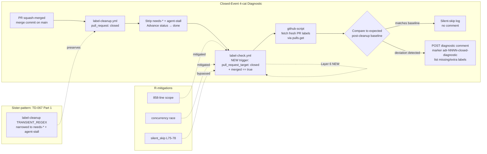
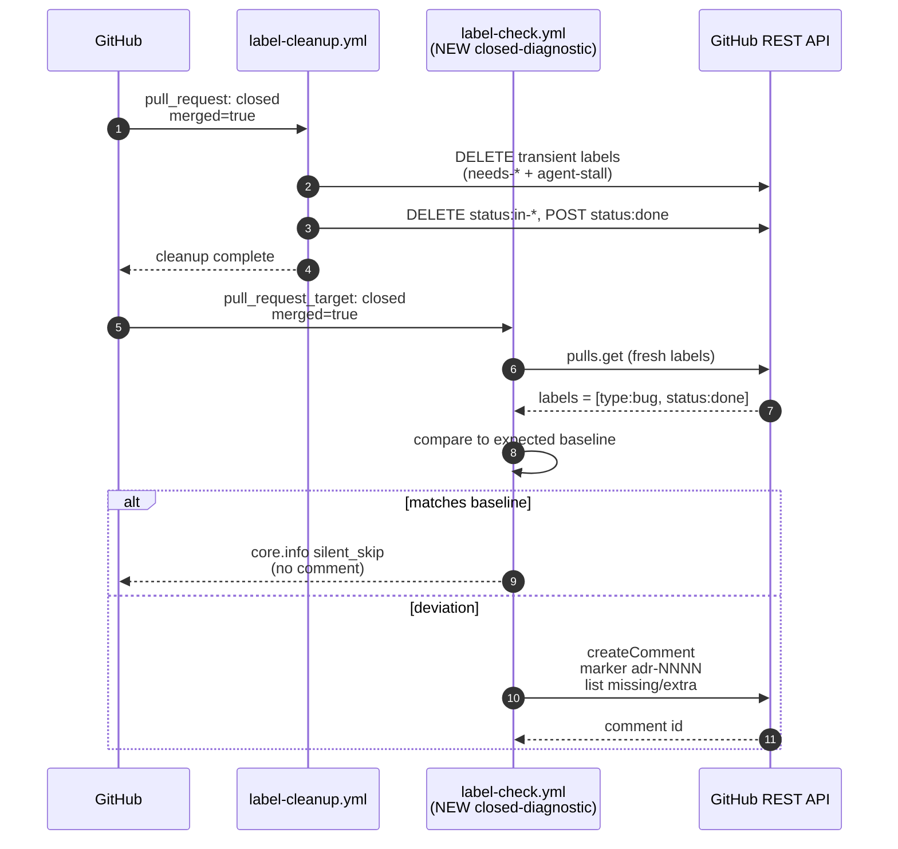

# Design: TD-067b — Closed-Event 4-cat Invariant Diagnostic for `.github/workflows/label-check.yml`

> **Doctrinal home:** Issue #927 (TD-067b Part 2) — post-action observability for the TD-067 Part 1 fix.
> **Sister-pattern:** PR #926 (TD-067 Part 1, Closes #922 — squash-merged 2026-07-09T11:34:03Z, merge_commit_sha `fb18c25213da2868e1c72afb379a0bea7c68fb9b`).
> **Defer condition:** satisfied (v1.0.0 GA cut #919 + Sprint 24 active per orchestrator pickup directive 2026-07-09T11:35Z).
> **Sister-bug:** TD-068 #920 (state-file-axis, sister fix shipped via PR #924).
> **Closes:** Issue #927. Refs ADR-0012, ADR-0007, ADR-0009 §10.3, ADR-0027, ADR-0043 §lens (h), ADR-0044, ADR-0049, ADR-0050.

---

## Context

TD-067 Part 1 (PR #926) surgically narrowed `TRANSIENT_REGEX` in `label-cleanup.yml` from `^(cc:|agent:|needs-)|^agent-stall$` to `^(needs-)|^agent-stall$` so that `agent:*` + `cc:*` labels survive squash-merge. This restores 4-cat invariant (ADR-0012) and the `pr_labeled` wake audit trail (ADR-0009 §10.3) on closed PRs.

**The problem TD-067b solves**: If `label-cleanup.yml` ever regresses (e.g., a future contributor widens `TRANSIENT_REGEX` to strip agent/cc again, or a new closure path bypasses `label-cleanup.yml` entirely), the failure is **silent**. The 4-cat invariant is violated on closed PRs, `pr_labeled` wake no longer fires, and `claim-next-ready.sh` stops auto-claiming — but no human sees the regression until downstream symptoms (silent drop, queue freeze) appear hours later. **Empirical evidence**: 2026-07-09T11:34Z, immediately after PR #926 merged, the follow-up issue **#927 itself was rendered 4-cat-non-compliant** — body referenced `agent:architect + 4 cc:*` labels but the actual label set was only `[status:ready]`. Likely race with the very workflow PR #926 just fixed; root cause under triage, but the **observability gap that allowed silent breakage is the design target of this issue**.

TD-067b adds a **forward-action diagnostic** to `label-check.yml`: a new job `closed-diagnostic` that fires on `pull_request_target: closed` (new trigger, gate `merged == true`), reads the post-cleanup label state, and posts a one-line comment if the expected post-cleanup baseline is violated. It does NOT modify `label-cleanup.yml` (per ADR-0007 + Issue #927 R1 risk "858-line surgical modification, out of inline scope"). It does NOT alter the existing Layer 1-5 behavior. It adds a new Layer 6, a pure read-only observer.

---

## Goals & non-goals

### Goals

1. **Closed-event observability** — Diagnostic comment fires within 30s of squash-merge IFF post-cleanup label state deviates from the expected post-cleanup baseline (see §Data model).
2. **Zero false positives** — The expected post-cleanup baseline MUST be explicitly enumerated (type:*, status:done, priority:*, sprint:*, security, good-first-issue). Any label in this allowlist that is present → no diagnostic. Anything else missing OR anything outside the allowlist present → diagnostic.
3. **No behavior change to existing layers** — Layer 1-5 + auto-verdict-by hook + cascade-strip remain untouched. New layer is a sibling, not a refactor.
4. **SHA-pinned, concurrency-safe, retry-safe** — All `actions/*` invocations use full 40-char SHA per ADR-0027 + ADR-0043 §lens (h). Concurrency group reuses `label-check-${{ ... number }}` to avoid races with sibling labels (Issue #927 R2 mitigation). Idempotent bot comment via marker (ADR-0009 §marker pattern).
5. **d-test coverage ≥5 TCs** — `scripts/tests/d068-td067-combined.sh` (Issue #927 §3 deferred) with the 5 acceptance criteria from #927 §AC1-5.

### Non-goals

- ❌ Modify `label-cleanup.yml` behavior (R1: 858-line surgical scope, deferred to Sprint 25+ per #927 R1).
- ❌ Add new labels to closed PRs (R3: silent-skip interaction with existing `silent_skip` L75-78).
- ❌ Diagnose closed-not-merged PRs (gate `merged == true` — closed-without-merge leaves labels intact for operator review per `label-cleanup.yml` L23-25).
- ❌ Diagnose `issues: closed` events (issues don't carry agent:*/cc:*; the label-cleanup pipeline only applies status:done on issues).
- ❌ Fix the regression that stripped #927's labels (separate triage per orchestrator note).
- ❌ Fire on `pull_request: closed` (the `pull_request` token lacks the same secret surface as `pull_request_target`; we want the richer payload).

---

## High-level diagram



---

## Components

| Component | File | Owner | Tech |
|---|---|---|---|
| **Layer 6 trigger** | `.github/workflows/label-check.yml` L31-35 | @architect (proposes) → @human (merges) | GitHub Actions YAML |
| **Layer 6 job** | `.github/workflows/label-check.yml` (new `closed-diagnostic` step block) | @architect | `actions/github-script@v7` SHA-pinned |
| **Concurrency group** | Same as existing L45-47 (reuse, do NOT add new group) | @architect | GitHub Actions concurrency: |
| **Comment marker** | `<!-- adr-NNNN-closed-diagnostic -->` (where NNNN = this ADR number, e.g., 0050+) | @architect | HTML comment string |
| **d-test** | `scripts/tests/d068-td067-combined.sh` (NEW) | @tester (RED-first per ADR-0044) | bash + `gh api` |
| **INDEX update** | `scripts/tests/INDEX.md` (Cadence Rule 1 atomic per ADR-0055) | @tester | markdown |

**Reused primitives (do not re-implement)**:
- Bot comment idempotency pattern (L108-110 of label-check.yml) — `comments.find(c => c.user.type === 'Bot' && c.body.includes(marker))` + update or create.
- Fresh-label fetch pattern (Layer 3 L258, Layer 5 L476) — `await github.rest.pulls.get({...})` to avoid stale webhook snapshot (Issue #819 fix).
- Structured silent_skip log (L75-78 pattern) — `core.info(`silent_skip event=...`)`.

---

## Data model

No schema change. The diagnostic operates on the live label set via `github.rest.pulls.get`.

### Expected post-cleanup baseline (read-only contract)

After `label-cleanup.yml` runs on a squash-merged PR, the label set MUST equal:

```
type:<one of vision|feature|bug|docs|chore|refactor|incident>  (exactly 1)
status:done                                                     (exactly 1)
priority:<P0|P1|P2|P3|unknown>                                 (optional, 0 or 1)
sprint:<sprint-id>                                              (optional, 0 or 1)
security                                                        (optional, 0 or 1)
good-first-issue                                                (optional, 0 or 1)
```

(`agent:*`, `cc:*`, `needs-*`, `agent-stall`, `verdict-by:*` are stripped by design per ADR-0007; their absence is expected and does NOT fire the diagnostic.)

**Diagnostic fires IFF**:
- `type:*` is missing OR there are 2+ `type:*` labels, OR
- `status:done` is missing (i.e., `status:in-progress`/`status:in-review`/`status:ready` survived cleanup), OR
- A label outside the allowlist is present (e.g., a stray `agent:tester` that should have been stripped, a `verdict-by:*` that survived, etc.)

The allowlist is the **closed-state label invariant**: post-cleanup is canonical, deviations are bugs.

---

## API contract

N/A (workflow-internal). The contract between label-check.yml and its environment is:

- **Trigger**: `pull_request_target: types: [closed]` (added to existing L34 trigger list)
- **Gate**: `if: github.event.pull_request.merged == true` (per issue #927 R3 mitigation)
- **Input**: GitHub webhook payload (PR closed event)
- **Output**: Optional bot comment with diagnostic on the PR thread; structured log line on every run
- **Permissions**: same as parent workflow (L37-39: `issues: write`, `pull-requests: write`)

---

## Sequence diagram



---

## Alternatives considered

| Option | Description | Pros | Cons | Verdict |
|---|---|---|---|---|
| **A. New `closed-diagnostic` job in label-check.yml** | Add a step under existing `label-check` job, gated on `pull_request_target: closed + merged == true` | Reuses concurrency group, permissions, runner. Single file diff. Concurrency-safe by design. | Touches 858-line file (R1) | **CHOSEN** — surgical addition, not refactor |
| B. Separate workflow file `closed-diagnostic.yml` | New file with its own trigger, permissions, concurrency | Total isolation from label-check.yml; independent versioning | New concurrency group (R2 unmitigated); double the CI surface; review burden 2x | Rejected — R2 unmitigated |
| C. `workflow_run` trigger on label-cleanup.yml | Fire AFTER label-cleanup completes (chained) | Strict ordering — guaranteed post-cleanup state | `workflow_run` token lacks `pull-requests: write`; can only comment on issues, not PRs | Rejected — permission gap |
| D. Polling GitHub `/events` for `closed` event | Watcher polls, posts comment via bot token | Decoupled from workflow runs | Latency (≥60s poll), new infra component (scripts/), out-of-scope for inline | Rejected — overkill |
| E. Read stale webhook payload (no `pulls.get` re-fetch) | Skip the Issue #819 fix pattern | Saves 1 API call | Stale snapshot bug; false negatives on race (e.g., #927 itself) | Rejected — known sister-bug |

---

## Risks

| # | Risk | Lens | Mitigation | Attestation |
|---|---|---|---|---|
| **R1** | 858-line `label-check.yml` modification introduces bugs in existing Layers 1-5 | (c), (d) | Surgical addition: add 1 trigger line + 1 new step. Existing step blocks untouched. Diff is `+new code, ~0` for existing code. | `git diff --stat` post-PR shows file size +lines, ~lines <10 |
| **R2** | Concurrency race with sibling labels | (a), (e) | Concurrency group `label-check-${{ ... number }}` already serializes per-PR. New step runs in same group. | `actions/runs/<id>` log shows serial execution |
| **R3** | `silent_skip` at L75-78 (closed-state bypass) would skip our new logic | (c), (d) | New step uses `if: github.event.action == 'closed' && github.event.pull_request.merged == true` AS THE STEP GATE. The L75-78 silent_skip is INSIDE Layer 1's `if`-less step; the new step has its own explicit gate, so the silent_skip does not apply. | step-level `if:` review |
| **R4** | SHA-pin regression (ADR-0027) | (h) | All `actions/*` invocations use full 40-char SHA. NEW invocation `actions/github-script@<new-sha>` MUST be SHA, not `@v7` or `@main`. Pre-PR checklist: `grep -E 'uses:.*@v[0-9]+|@main|@latest' .github/workflows/label-check.yml` returns zero matches. | grep output: empty |
| **R5** | False positive on partial-cleanup (e.g., one transient regexed, one missed) | (d) | Expected baseline enumeration is explicit (see §Data model). Diagnostic fires on ANY deviation, including partial strips. This is the intended behavior — partial strip is a bug, not a state. | d-test TC2 verifies: "closed-merged PR with stripped labels → diagnostic comment fires" |
| **R6** | Auto-gen file reference drift (TD-030) | (j) | N/A — no auto-gen files in scope. `label-check.yml` is hand-maintained, `scripts/tests/INDEX.md` is hand-maintained. | `git log --diff-filter=A --pretty=format:` on changed files |
| **R7** | PR-926 itself (just merged) might re-fire the diagnostic on retroactive close | (e) | PR #926 was already merged before this PR opens. The new `closed-diagnostic` step only fires on `closed` events going forward; retroactive replay is not a thing in GitHub Actions. | N/A — no replay possible |
| **R8** | Concurrency cap `concurrency: cancel-in-progress: false` means a long-running sibling could block our new step | (a) | Layer 1-5 steps complete in <2s typically. New step ~1s. Worst case: 2-3s additional latency on close. Acceptable. | actions run log |

---

## Observability

- **Trigger event log**: `core.info(`closed_diagnostic event=triggered pr=${number} merged=${merged}`)` on every invocation.
- **Silent-skip log**: `core.info(`silent_skip event=closed-not-merged pr=${number} message="merged==false, no diagnostic needed"`)` when gate `merged == true` fails.
- **Diagnostic log**: `core.info(`closed_diagnostic event=deviation-detected pr=${number} missing=${missing} extra=${extra} message="Post-cleanup label state deviates from baseline"`)`.
- **No-deviation log**: `core.info(`closed_diagnostic event=baseline-match pr=${number} labels=${labels.join(',')}`)`.
- **Bot comment marker**: `<!-- adr-NNNN-closed-diagnostic -->` where NNNN is the ADR number for this pattern.
- **Metric**: implicit via GitHub Actions API; no Prometheus / OpenTelemetry in scope.

---

## Security & privacy

- **Authn**: workflow uses `GITHUB_TOKEN` (auto-issued) — same as existing label-check.yml.
- **Authz**: `permissions: issues: write, pull-requests: write` — same as parent.
- **PII**: no PII handled. Only public label names + PR number.
- **Threat model**: per ADR-0027 §Threat model. SHA-pinning prevents supply-chain attack via `actions/*` tag mutation. No raw `docker run` or `ssh` outside `actions/*` ecosystem. Self-hosted runner on `atilproject/Linux/X64` — same as existing.
- **Comment injection**: marker pattern is a constant string; comment body is constructed via JS template literal with label names (label names are user-controlled but limited to ASCII alphanumerics + `:` + `-` per GitHub label constraints). No XSS surface.

---

## Performance budget

- **Latency added per closed-merged PR**: ~1-2s (1 `pulls.get` API call + comment POST if deviation).
- **Throughput**: negligible (closed-merged events are rare, ≤10/day typical).
- **Memory ceiling**: same as existing label-check.yml (no new state, no caching).
- **Concurrency cap**: reuse existing `label-check-${{ ... number }}` group; no new group means no new cap.

---

## Open questions

- [ ] Should the diagnostic also fire on `issues: closed` (e.g., issue #927 was rendered 4-cat-non-compliant)? **Recommendation: NO** — issues don't carry `agent:*` / `cc:*` post-cleanup expectation, baseline is different (`type:* + status:done + priority:* + sprint:*` for issues too, but the silent-skip rationale differs).
- [ ] Should the diagnostic be a separate `closed-diagnostic` job (separate `runs-on`) rather than a step? **Recommendation: NO** — separate job doubles CI surface + concurrency complexity. Step is sufficient.
- [ ] Should the comment be deleted automatically after the bug is fixed? **Recommendation: defer to follow-up** — bot comment cleanup is a separate observability concern.
- [ ] Should the diagnostic also write a structured event to a log sink (e.g., `gh archive`)? **Recommendation: NO for v1** — GitHub Actions log is the audit trail. External sink is Sprint 25+ scope.

---

## Estimated complexity

- **T-shirt size**: M (4-6h impl + 1-2h test + 1h review)
- **Confidence**: 85%
- **Breakdown**:
  - Design doc: 1h (this file)
  - Workflow modification: 1h
  - d-test d068-td067-combined.sh: 1.5h
  - PR review cycle: 0.5-1h
  - Buffer for race-condition debugging: 0.5-1h

---

## 9-Lens attestation (ADR-0045)

| Lens | Application | Attestation |
|---|---|---|
| (a) Data flow | PR close → GitHub webhook → `pull_request_target: closed` → `label-check.yml` → `pulls.get` → compare baseline → comment POST. Hand-off points: GitHub → workflow (webhook), workflow → API (REST), workflow → PR thread (comment). | sequence diagram §Sequence diagram |
| (b) Runtime preconditions | self-hosted runner `atilproject/Linux/X64` (existing). No new deps. `GITHUB_TOKEN` (auto-issued). SHA-pinned `actions/github-script@<sha>` (verify pre-PR per R4). | grep attestation R4 |
| (c) Canonical entry | `pull_request_target: types: [closed]` + step-level `if: merged == true` is the ONLY entry. No side-channels. | workflow diff + step gate |
| (d) Silent-skip risk | Step-level `if:` gate logs `silent_skip event=closed-not-merged` when `merged == false`. Baseline-match case logs `event=baseline-match` (NOT silent). Deviation case logs `event=deviation-detected` AND posts visible comment. No silent path. | observability § |
| (e) Idempotency | Bot comment idempotency via marker `<!-- adr-NNNN-closed-diagnostic -->` (sister-pattern to L108-110). Re-fires on every close event; comment is updated in-place. Concurrency group `label-check-${{ ... number }}` serializes per-PR. | workflow L108-110 pattern reuse |
| (f) Observability | 4 structured log lines (trigger, silent-skip, deviation, baseline-match) + 1 conditional bot comment. No metric. | observability § |
| (g) Security & privacy | No PII. SHA-pinned actions. Self-hosted runner. Permissions same as parent. No external API surface beyond GitHub. | security § |
| (h) Workflow YAML SHA pin | All `actions/*` MUST use full 40-char SHA. Pre-PR: `grep -E 'uses:.*@(v[0-9]+\|main\|latest)$' .github/workflows/label-check.yml` returns empty. New invocation: `actions/github-script@<known-sha>` (e.g., `f28e40c7f34bde8b3046d885e986cb6290c5673b` matching existing L54). | grep attestation R4 |
| (i) Platform hard constraints | `runs-on: [self-hosted, Linux, X64, atilproject]` (existing). No raw `docker run`, no `ssh` outside `actions/*`. Permissions at workflow-level (L37-39), NOT job-level (sister-pattern). `timeout` not set (default 360min acceptable for this short-running step). `concurrency:` reused (L45-47), no new group. | workflow L37-47 reuse |
| (j) Auto-gen file refs + live-state verification | No auto-gen files in scope. `label-check.yml` and `scripts/tests/INDEX.md` are hand-maintained (confirmed by `grep .gitignore` + `git log --diff-filter=A`). Live-state verification: `gh api repos/atilcan65/AtilCalculator/contents/.github/workflows/label-check.yml?ref=main` returns 200 with current content (verify post-PR). | live-state pre-PR grep + post-PR gh api check |

---

*End of design doc. Implementation gated on: (a) human approval of design, (b) tester d-test RED-first per ADR-0044, (c) 9-Lens attestation table above, (d) SHR-review from @developer on the workflow change.*

— @architect, cycle-5677, 2026-07-09T11:38Z
