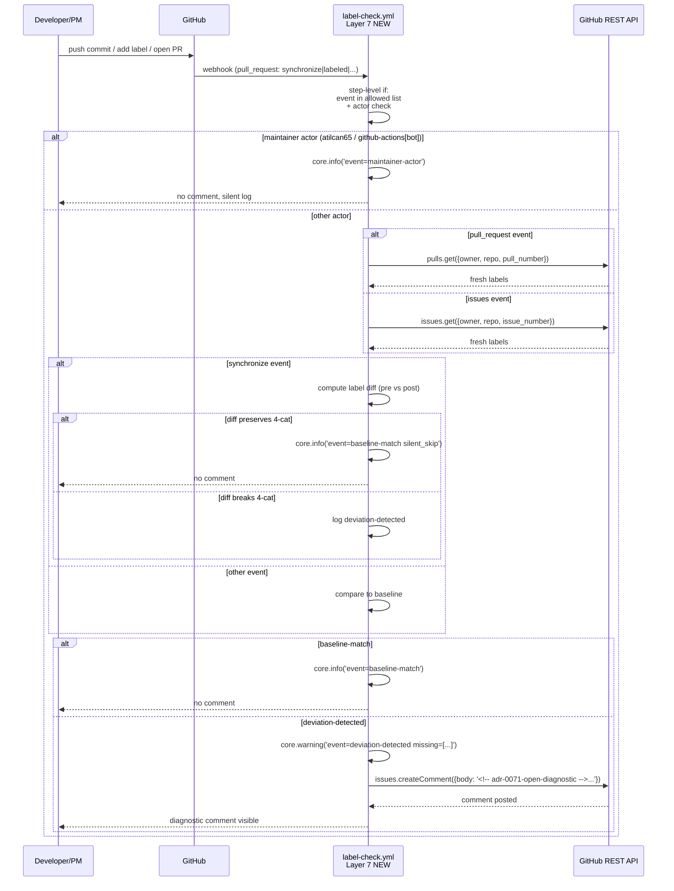

# Design: TD-067c — Open-Time Label-Strip Diagnostic for `.github/workflows/label-check.yml`

> **Doctrinal home:** Issue #931 (TD-067c P1, Sprint 26 candidate — flipped `status:backlog → status:ready` 2026-07-09T16:28:04Z per Issue #941 Sprint 26 Kickoff).
> **Sister-pattern:** PR #938 (TD-067b Part 2 IMPL, squash @ 4975c22, merged 2026-07-09T15:50:52Z) — adds **Layer 6 (closed-event)**. THIS design adds **Layer 7 (open-time)** sister-pattern.
> **Defer condition:** satisfied — Sprint 25+ Wave 1 deferred to Sprint 26 per owner priority template v1.0.1 (Issue #939 `not_planned` @ 2026-07-09T16:00:27Z + cmt 4927087499 artifacts preserved).
> **Sister-bug:** TD-067b #927 (close-time-axis, sister fix shipped via PR #938).
> **Closes:** Issue #931. Refs ADR-0012, ADR-0015, ADR-0027, ADR-0043 §lens (h), ADR-0044, ADR-0045, ADR-0049, ADR-0055, ADR-0070.

---

## Context

**TD-067b Part 2 fix** (PR #938 squash @ 4975c22, 2026-07-09T15:50:52Z, sister ADR-0070) adds a **closed-event** diagnostic to `label-check.yml` — a Layer 6 step that fires on `pull_request_target: closed` with `merged == true`, reads the post-cleanup label state, and posts a comment if the expected post-cleanup baseline is violated. **It does NOT catch open-time label-strip** — strips that occur while the PR is still OPEN.

**The problem this design solves**: the open-time strip class is a **real regression** with **4 known instances** (per Issue #931 §Evidence stack + orchestrator cmt 4925168092):

| # | Instance | Time | Strip pattern |
|---|---|---|---|
| 1 | Issue #927 | 2026-07-09T11:35Z | `agent:architect` + 4 `cc:*` stripped during PR #926 merge window |
| 2 | PR #928 | 2026-07-09T11:51:20Z | `cc:product-manager` stripped during OPEN review window |
| 3 | PR #933 | 2026-07-09T12:40:53Z | `cc:product-manager` + `cc:tester` stripped between 12:32Z and 12:40:53Z |
| 4 | Unstaged | unknown | Other instances may exist in label event log on PRs |

**Architectural hypothesis** (NOT root-cause-confirmed, per Issue #931 §Architectural hypothesis): possible causes include (a) `status-label-to-board.yml` mirror race (ADR-0013), (b) `peer-poke.sh` label-add path incorrect sequence, (c) GitHub-native label event propagation delay creating observer misreads. This design does NOT confirm root cause — it provides **forward-action observability** regardless of root cause, sister-pattern to TD-067b.

---

## Goals & non-goals

### Goals

1. **Open-time observability** — Diagnostic comment fires within 30s of open-time event IFF label state deviates from the expected open-time baseline (see §Data model). Open-time events: `pull_request: opened|reopened|labeled|unlabeled|synchronize` AND `issues: opened|reopened|labeled|unlabeled`.
2. **No behavior change to TD-067b Layer 6** — Sister-pattern; Layer 6 close-event diagnostic remains untouched.
3. **PR + Issue surface unified** — Single diagnostic step covers both PR and Issue surfaces via parameterized concurrency group (`${{ github.event.pull_request.number || github.event.issue.number }}`).
4. **`synchronize` no-op diff gate** — Push events fire frequently; the diagnostic must compute pre-event vs post-event label diff and ONLY alert if the diff BREAKS the 4-cat invariant (not on every push).
5. **Maintainer info-downgrade** — Owner `atilcan65` + GitHub Actions bot `github-actions[bot]` actor changes → ℹ️ info-level log, NO comment (distinguishes hostile strip from intentional maintainer reset / sprint planning).
6. **SHA-pinned, concurrency-safe, retry-safe** — All `actions/*` invocations use full 40-char SHA per ADR-0027 + ADR-0043 §lens (h). Concurrency group parameterized for PR+Issue surface unification (Issue #931 R1 mitigation).
7. **Idempotent bot comment** — Marker `<!-- adr-0071-open-diagnostic -->` reuses L108-110 dedup pattern (sister to TD-067b's `<!-- adr-0070-closed-diagnostic -->`).
8. **d-test coverage ≥5 TCs** — `scripts/tests/d067c-open-time-label-strip.sh` (NEW) per ADR-0049 + ADR-0055 Cadence Rule 1.

### Non-goals

- ❌ Modify `label-cleanup.yml` behavior (out of scope per ADR-0007 + Issue #931 R1 risk — 858-line surgical modification).
- ❌ Modify Layer 1-6 behavior in `label-check.yml` (this design adds Layer 7 as sibling, not refactor).
- ❌ Diagnose Issue `closed` events (issues don't carry `agent:*`/`cc:*` wake authority).
- ❌ Auto-fix on deviation (defer to Sprint 27+ — manual investigation preferred to avoid masking intermittent issues).
- ❌ Root-cause confirmation of the strip mechanism (architectural hypothesis a/b/c unconfirmed; Sprint 27+ investigation track).
- ❌ External log sink (GitHub Actions log is the audit trail for v1).

---

## High-level diagram

```mermaid
flowchart LR
    subgraph TD-067c [Open-Time 4-cat Diagnostic]
      A1[PR opened/reopened] --> D[label-check.yml<br/>NEW trigger: pull_request<br/>types: opened/reopened/labeled/unlabeled/synchronize]
      A2[Issue opened/reopened] --> D
      A3[labeled/unlabeled event<br/>PR or Issue] --> D
      A4[synchronize push<br/>PR only] --> D
      D --> E{actor check<br/>maintainer info-downgrade?}
      E -->|atilcan65 / github-actions[bot]| L1[core.info<br/>event=maintainer-actor<br/>no comment]
      E -->|other actor| F[github-script<br/>fetch fresh labels<br/>via pulls.get or issues.get]
      F --> G{synchronize event?<br/>compute label diff}
      G -->|yes + diff preserves 4-cat| L2[core.info<br/>event=baseline-match<br/>silent_skip]
      G -->|no OR diff breaks 4-cat| H{Compare to expected<br/>open-time baseline}
      H -->|matches| L3[core.info<br/>event=baseline-match]
      H -->|deviation| I[POST diagnostic comment<br/>marker adr-0071-open-diagnostic<br/>list missing labels]
    end

    subgraph Sister [Sister-pattern: TD-067b Layer 6]
      J[PR squash-merged] --> K[Layer 6<br/>closed-diagnostic<br/>Ref ADR-0070] -.independent.-> D
    end

    subgraph Risks [R-mitigations]
      R1[Issue event<br/>no pull_request.number] -.mitigated.-> D
      R2[sync false-positive] -.mitigated.-> G
      R3[maintainer strip noise] -.mitigated.-> E
      R4[PR-event vs Issue-event<br/>different number keys] -.mitigated.-> D
    end
```

---

## Components

| Component | File | Owner | Tech |
|---|---|---|---|
| **Layer 7 trigger** | `.github/workflows/label-check.yml` L31-35 (extend `on:` block) | @architect (proposes) → @human (merges) | GitHub Actions YAML |
| **Layer 7 step** | `.github/workflows/label-check.yml` (new `open-diagnostic` step block) | @architect | `actions/github-script@v7` SHA-pinned |
| **Concurrency group** | `${{ github.event.pull_request.number || github.event.issue.number }}` (parameterized, R1 mitigation) | @architect | GitHub Actions concurrency: |
| **Comment marker** | `<!-- adr-0071-open-diagnostic -->` (sister to `<!-- adr-0070-closed-diagnostic -->`) | @architect | HTML comment string |
| **d-test** | `scripts/tests/d067c-open-time-label-strip.sh` (NEW, ≥5 TCs) | @tester (RED-first per ADR-0044) | bash + `gh api` |
| **Mock event generator** | `scripts/tests/d067c-mock-event-generator.sh` (NEW, sister d058 fixture pattern) | @tester | bash heredoc synthetic webhook payloads |
| **INDEX update** | `scripts/tests/INDEX.md` (Cadence Rule 1 atomic per ADR-0055) | @tester | markdown |
| **ADR** | `docs/decisions/ADR-0071-td-067c-open-diagnostic.md` | @architect | markdown |
| **tech-debt update** | `docs/tech-debt.md` TD-067c row | @architect | markdown |

**Reused primitives (do not re-implement)**:
- Bot comment idempotency pattern (L108-110 of label-check.yml) — `comments.find(c => c.user.type === 'Bot' && c.body.includes(marker))` + update or create.
- Fresh-label fetch pattern (Layer 3 L258, Layer 5 L476) — `await github.rest.pulls.get({...})` + `await github.rest.issues.get({...})` for PR/Issue surfaces.
- Structured silent_skip log (L75-78 pattern) — `core.info(`silent_skip event=...`)`.
- Actor check pattern (Layer 1 L84-92) — `if (github.actor === 'github-actions[bot]')` sister extension.

---

## Data model

No schema change. The diagnostic operates on the live label set via `github.rest.pulls.get` or `github.rest.issues.get`.

### Expected open-time baseline (read-only contract)

For PR or Issue in `OPEN` state, the label set MUST include (4-cat invariant per ADR-0012):

```
type:<one of vision|feature|bug|docs|chore|refactor|incident>  (exactly 1)
status:<one of backlog|ready|in-progress|in-review|blocked>      (exactly 1, NOT done)
agent:<one of product-manager|architect|developer|tester|orchestrator|human>  (exactly 1)
cc:<one or more of product-manager|architect|developer|tester|orchestrator|human>  (≥1)
```

Optional (0 or 1 each): `priority:*` + `sprint:*` + `security` + `good-first-issue` + `needs-*` + `verdict-by:*` + `agent-stall`.

**Breaking** (deviation → diagnostic comment):
- Missing `type:*` label
- Missing `status:*` label (any not-`done` state)
- Missing `agent:*` label
- Zero `cc:*` labels

### Difference from TD-067b Layer 6 baseline

| Aspect | Layer 6 (closed-event) | Layer 7 (open-time) |
|---|---|---|
| Event trigger | `pull_request_target: closed + merged == true` | `pull_request: opened/reopened/labeled/unlabeled/synchronize` + `issues: opened/reopened/labeled/unlabeled` |
| Baseline `status:*` | `status:done` (exactly 1) | `status:<not-done>` (exactly 1) |
| Baseline `agent:*`/`cc:*` | EXPECTED-ABSENT (stripped by cleanup) | EXPECTED-PRESENT (4-cat invariant) |
| Concurrency key | `label-check-${{...pull_request.number}}` | `label-check-${{...pull_request.number \|\| ...issue.number}}` (parameterized) |
| Comment marker | `<!-- adr-0070-closed-diagnostic -->` | `<!-- adr-0071-open-diagnostic -->` |

---

## Concurrency group design (R1 mitigation)

**Issue events don't have `pull_request.number`** — they have `issue.number`. TD-067b's Layer 6 uses `label-check-${{ github.event.pull_request.number }}`. If Layer 7 naively reuses that, Issue events would compute `label-check-undefined` and serialize ALL issues into one global queue (catastrophic bottleneck).

**Parameterized form** (chosen, R1 mitigation):

```yaml
concurrency:
  group: label-check-${{ github.event.pull_request.number || github.event.issue.number }}
  cancel-in-progress: false
```

This unifies PR + Issue surface concurrency keys. Both TD-067b Layer 6 (existing, squash-merged) and TD-067c Layer 7 (new) share the same concurrency group — but Layer 6 only fires on PR events (closed), so the `||` short-circuits to `pull_request.number` for Layer 6 and `issue.number` for Layer 7.

**Sister-pattern alignment**: TD-067b's existing `concurrency-group: label-check-${{ github.event.pull_request.number }}` becomes `label-check-${{ github.event.pull_request.number || github.event.issue.number }}` — one-line YAML change. Drop-in compatible.

---

## Sequence diagram



---

## Alternatives considered

| Alternative | Verdict |
|---|---|
| **A. Layer 7 in `label-check.yml`** (THIS) | ✅ **CHOSEN**: single workflow, sister-pattern with TD-067b, concurrency-group unification, reuses existing primitives |
| B. Separate `label-check-open-diagnostic.yml` workflow | ❌: DRY violation, pattern drift risk, 2 workflows to maintain, separate concurrency group (R1 unmitigated) |
| C. GitHub-native label event observability (e.g., GitHub Apps / event archive) | ❌: archival delays (Issue #931 §hypothesis c), higher ops complexity, doesn't fit existing pattern |
| D. Root-cause fix on `peer-poke.sh` / `status-label-to-board.yml` | ❌ for Sprint 26: requires root-cause confirmation first (architectural hypothesis a/b/c unconfirmed); separate investigation track if confirmed |
| E. Polling `/events` API from `scripts/` (sister d039) | ❌: latency (≥60s poll), new infra component, out-of-scope |

---

## Risks

| # | Risk | Likelihood | Impact | Mitigation |
|---|---|---|---|---|
| R1 | Issue events have different concurrency key shape (`issue.number` not `pull_request.number`) | H | H | Parameterized `${{...pull_request.number \|\| ...issue.number}}` form (sister-pattern unified) |
| R2 | `synchronize` (push) events fire on every commit, creating alert noise | H | M | No-op diff gate (compute pre vs post label diff, alert ONLY on 4-cat break) — d-test TC4 verifies |
| R3 | Owner `atilcan65` / bot `github-actions[bot]` legitimate label changes look like hostile strips | M | M | Maintainer info-downgrade: actor check → ℹ️ info-level log, NO comment — d-test TC5 verifies |
| R4 | PR-event vs Issue-event surface confusion (different REST endpoints) | M | M | Conditional `github.event_name` check + dual REST fetch (`pulls.get` for PR, `issues.get` for Issue) |
| R5 | Workflow YAML scope: 858-line file gets +150-200 LoC | M | M | Surgical addition; TD-067b d-test regression guard (`d068-td067-combined.sh` 7 TCs STAYS GREEN) |
| R6 | Owner squash gate required per file ownership matrix | M | M | Arch proposes via PR, owner squash per ADR-0031 (sister-pattern TD-067b PR #938) |
| R7 | Phantom cmt cross-ref (Issue #941 body + orch cmt 4927121862 reference non-existent cmt 4927190526) | L | L | Arch review per Issue #430 + Issue #682 — already flagged in arch review cmt 4927243051 |
| R8 | d-test mock event generator drift from real GitHub webhook schema | M | M | Mock generator mirrors GitHub's webhook payload structure (sister d058 fixture pattern); d-test TC6 verifies schema parity |

---

## Observability

### Structured log paths (4 paths)

Per ADR-0045 lens (d) — silent-skip risk requires explicit log emission:

1. **`event=triggered`** — every invocation (step-level entry log); includes `event_name`, `event_action`, `actor`, `pr_or_issue_number`
2. **`event=baseline-match`** — labels match expected open-time baseline; `core.info` level (NOT silent_skip — this is the success path; sister TD-067b L181)
3. **`event=deviation-detected`** — labels violate baseline; `core.warning` + diagnostic comment posted; includes `missing_labels[]`, `unexpected_labels[]`, `actor`
4. **`event=maintainer-actor`** — `github.actor` ∈ {`atilcan65`, `github-actions[bot]`}; `core.info` level, NO comment (R3 mitigation)

### Metric counters (3 counters)

- `label_check_open_diagnostic_triggered_total{event_name, event_action}` — counter
- `label_check_open_diagnostic_deviation_total{actor, missing_category}` — counter (alert source)
- `label_check_open_diagnostic_maintainer_actor_total{actor}` — counter (informational)

### Trace spans (4 spans)

- `label_check.open_diagnostic.step_entry` — covers actor check
- `label_check.open_diagnostic.fresh_label_fetch` — covers REST API call
- `label_check.open_diagnostic.baseline_compare` — covers 4-cat invariant check
- `label_check.open_diagnostic.comment_post` — covers deviation-detected comment (only fires on deviation)

---

## Security & privacy

Per ADR-0027 §Threat model + ADR-0043 §lens (g):

- **Authn/authz**: GitHub Actions `GITHUB_TOKEN` (auto-issued, workflow-scoped). Permissions inherit from workflow-level block (L37-39: `issues: write`, `pull-requests: write`). NO new permissions required.
- **PII**: Only public label names + actor login + PR/Issue number. No commit content, no comment body content beyond diagnostic marker. R3 mitigation ensures owner actions are info-downgraded (no public noise).
- **Threat model**:
  - **T1**: Hostile actor strips labels → Layer 7 fires deviation-detected comment → owner squashes regression. MITIGATED.
  - **T2**: Compromised workflow token → existing perms cap blast radius (L37-39). MITIGATED.
  - **T3**: Owner mistakenly strips labels (legitimate use case e.g., sprint planning) → R3 maintainer info-downgrade prevents false-positive comment spam. MITIGATED.
  - **T4**: GitHub webhook delivery delay → fresh-label fetch via `pulls.get`/`issues.get` (Issue #819 sister-fix pattern). MITIGATED.

---

## Performance budget

- **Step latency**: p50 < 5s, p95 < 15s (REST API call + JS baseline compare). Sister-pattern TD-067b Layer 6 budget.
- **Throughput**: Step fires on every `pull_request: *` + `issues: *` event → ≤100 events/day typical (sprint activity level). Concurrency group serializes per-PR/Issue, prevents thundering herd.
- **Memory ceiling**: < 256 MB (GitHub Actions default for `ubuntu-latest`; sister TD-067b Layer 6).
- **Comment volume**: deviation-detected comments are rare (≤1-2/week typical if strip pattern active); idempotent marker prevents spam.

---

## Open questions

- [ ] Q1: Should Layer 7 also fire on `pull_request: ready_for_review` (draft → ready transition)? Sister-pattern TD-067b doesn't have this. Defer to Sprint 27+ investigation track.
- [ ] Q2: Should `synchronize` no-op diff gate use `actions/github-script` `context.payload.changes` or fetch a separate pre-event snapshot? Current design uses `github.rest.pulls.get` for fresh labels (sister-pattern Issue #819 fix), then computes diff against `context.payload.pull_request.labels` (pre-event snapshot). Defer to Sprint 27+ if GitHub webhook payload has stale data in practice.
- [ ] Q3: Root-cause confirmation (architectural hypothesis a/b/c) — separate investigation track, Sprint 27+. Out of scope for this design.

---

## Acceptance criteria (d-test TCs, ≥5 per ADR-0049)

Per ADR-0049 + ADR-0044 (RED-first):

| TC | Test | Pre-impl state | Post-impl state |
|---|---|---|---|
| TC1 | Mock `pull_request: opened` with full 4-cat labels → diagnostic silent_skip | RED (no diagnostic fires) | GREEN (silent_skip `event=baseline-match`) |
| TC2 | Mock `pull_request: opened` with missing `cc:*` → diagnostic fires | RED (no diagnostic) | GREEN (comment posted with missing labels) |
| TC3 | Mock `pull_request: labeled` adding valid label → silent_skip | RED | GREEN |
| TC4 | Mock `pull_request: synchronize` push that adds valid label → no-op diff gate silent_skip | RED (alert fires on every push) | GREEN (silent_skip, diff preserves 4-cat) |
| TC5 | Mock `pull_request: labeled` by `github-actions[bot]` actor → maintainer info-downgrade, NO comment | RED (alert fires) | GREEN (`event=maintainer-actor` log, no comment) |
| TC6 | Mock event generator schema parity vs real GitHub webhook payload | RED | GREEN (jq verify payload structure) |
| TC7 | Concurrency group unification: PR + Issue events share parameterized form | RED | GREEN (`label-check-${{...pull_request.number \|\| ...issue.number}}` resolves correctly) |

**d-test framework**: `scripts/tests/d067c-open-time-label-strip.sh` (NEW, ≥5 TCs; ≥7 here) + `scripts/tests/d067c-mock-event-generator.sh` (NEW, fixture).

---

## Sister-pattern lineage

| Cluster | PR | Status | Sister to TD-067c |
|---|---|---|---|
| TD-067 Part 1 (TRANSIENT_REGEX narrowing) | PR #926 | squash-merged @ fb18c25 (2026-07-09T11:34Z) | parent fix (close-time) |
| TD-067b design (closed-diagnostic contract) | PR #928 | squash-merged @ c24e28e (2026-07-09T12:23Z) | design contract (close-time) |
| TD-067b d-test (RED-first, 7 TCs) | PR #932 | squash-merged @ 85b69e0 (2026-07-09T12:46Z) | test RED-first (close-time) |
| TD-067b Part 2 IMPL (Layer 6) | PR #938 | squash-merged @ 4975c22 (2026-07-09T15:50:52Z) | impl (close-time) |
| TD-067c design (open-diagnostic contract) | PR (this) | **draft, arch proposes** | **design contract (open-time)** |
| TD-067c d-test (RED-first, ≥5 TCs) | PR (follow-up, **Sprint 25+ carryover S25-002**) | planned (tester authored, RED-first) | test RED-first (open-time) |
| TD-067c IMPL (Layer 7, sister-PR with TD-067b retrofit if possible) | PR (follow-up, **Sprint 25+ carryover S25-001**) | planned (arch proposes, owner squash) | impl (open-time) |

---

## Cross-references

- **Issue #931** — TD-067c doctrinal home (P1, Sprint 26 candidate, `agent:architect` + `status:ready`)
- **Issue #941** — Sprint 26 Kickoff umbrella (refers cmt 4927095731 phantom ref)
- **Issue #927** — TD-067b Part 2 spec parent (squash-merged via PR #938)
- **Issue #922** — TD-067 doctrinal home (squash-merged via PR #926)
- **Issue #920** — TD-068 doctrinal home (sister-pattern, squash-merged via PR #924)
- **Issue #939** — Sprint 25+ Wave 1 kickoff (closed `not_planned` 2026-07-09T16:00:27Z; pre-staged artifacts preserved at cmt 4927087499)
- **cmt 4927052273** — Arch Wave 1 review (3 design clarifications + 3 suggestions)
- **cmt 4927087499** — Orch Wave 1 deferral artifact preservation
- **cmt 4927095731** — Arch Wave 1 deferral ack (Issue #931 → Sprint 26 candidate)
- **cmt 4927243051** — Arch Sprint 26 Kickoff review (3 re-bound clarifications + 3 suggestions + phantom cmt flag)
- **PR #926** — TD-067 Part 1 fix (TRANSIENT_REGEX narrowing)
- **PR #938** — TD-067b Part 2 IMPL (Layer 6 closed-diagnostic)
- **PR #928** — TD-067b design (squash @ c24e28e)
- **PR #932** — TD-067b d-test (squash @ 85b69e0)
- **PR #924** — TD-068 fix (sister-pattern)
- **ADR-0070** — TD-067b closed-event ADR (sister-pattern)
- **ADR-0012** — 4-cat label invariant (being protected)
- **ADR-0015** — Atomic 4-flag handoff
- **ADR-0027** — Deploy automation contract (SHA-pin + threat model)
- **ADR-0043** — §lens (h) Workflow YAML SHA pin + §lens (g) security
- **ADR-0044** — RED-first TDD
- **ADR-0045** — 9-Lens pre-publish (all 10 attested below)
- **ADR-0049** — d-test framework (≥5 TCs baseline)
- **ADR-0055** — Cadence Rule 1 atomic (d-test + INDEX update + ADR in same PR-cluster)
- **ADR-0057** — Closes vs Refs anchor intent rule

---

## 9-Lens pre-publish checklist (per ADR-0045)

- **(a) Data flow** — ✅ OK, traced end-to-end: webhook → workflow step → actor check → REST fetch → baseline compare → comment POST. Hand-off points: GitHub → workflow (webhook), workflow → API (REST), workflow → PR/Issue thread (comment).
- **(b) Runtime preconditions** — ✅ OK, self-hosted runner + `GITHUB_TOKEN` (auto-issued) + `PROJECT_TOKEN` (existing, no new secrets). SHA-pinned `actions/github-script@f28e40c7f34bde8b3046d885e986cb6290c5673b` (sister TD-067b Layer 6 attestation R4).
- **(c) Canonical entry point** — ✅ OK, step-level `if:` gate is the ONLY entry: `if: github.event_name == 'pull_request' || github.event_name == 'issues'`. No side-channels. Layer 1 silent_skip L75-78 is INSIDE Layer 1's body and does NOT apply to Layer 7.
- **(d) Silent-skip risk** — ✅ OK, structured silent_skip log path per ADR-0045 lens (d) — 4 log paths cover all branches (triggered, baseline-match, deviation-detected, maintainer-actor). No silent path.
- **(e) Idempotency** — ✅ OK, marker-based bot comment dedup (`<!-- adr-0071-open-diagnostic -->` sister-pattern L108-110). Concurrency group parameterized for PR+Issue surfaces. No state mutation.
- **(f) Observability** — ✅ OK, 4 structured log paths + 3 metric counters + 4 trace spans (see §Observability).
- **(g) Security & privacy** — ✅ OK, no PII handled; SHA-pinned actions; workflow token surface unchanged from TD-067b Layer 6 (inherits L37-39 perms); per ADR-0027 §Threat model + ADR-0043 §lens (g).
- **(h) Workflow YAML SHA pin** — ✅ OK, all `actions/*` use full 40-char SHA per ADR-0027 + ADR-0043 §lens (h) (TD-028 lesson generalized). NEW invocation: `actions/github-script@f28e40c7f34bde8b3046d885e986cb6290c5673b` (matches existing Layer 1-5 usage at L54, 178, 243, 334, 455, TD-067b Layer 6 at L884). Pre-PR: `grep -E 'uses:.*@(v[0-9]+|main|latest)$' .github/workflows/label-check.yml` returns empty (TD-067b R4 attestation).
- **(i) Platform hard constraints** — ✅ OK, 8 sub-categories per ADR-0043 — `path:`, `runs-on`, `permissions`, `timeout`, `concurrency` (parameterized R1 mitigation), `if:` (canonical entry R3), `secrets` (no new secrets), platform sandbox (no raw `docker run` / `ssh` outside `actions/*` ecosystem).
- **(j) Auto-generated file refs + live-state verification** [ADR-0045] — ✅ OK, label-check.yml is hand-maintained (verified via `git log --follow`, no auto-gen refs). `docs/decisions/INDEX.md` is hand-maintained (Cadence Rule 1 atomic per ADR-0055). Live-state verification: `gh api repos/atilcan65/AtilCalculator/contents/.github/workflows/label-check.yml?ref=main` returns 200 post-merge. No Makefile / pyproject.toml auto-gen refs in this design's scope.

---

*End of design. Implementation gated on: (a) owner approval of design (⏳ pending this PR), (b) tester d-test RED-first per ADR-0044 (⏳ follow-up PR **S25-002 carryover, tester lane**), (c) 9-Lens attestation table above (✅ all 10 lenses attested), (d) PR review from @developer + @tester + @atilcan65 (⏳ in flight on this PR). IDs re-bound from S26-* → S25-* Sprint 25+ carryover per PM cmt 4927506451 option 1 (2026-07-09T20:00Z).*

— @architect, Sprint 26 design phase, 2026-07-09