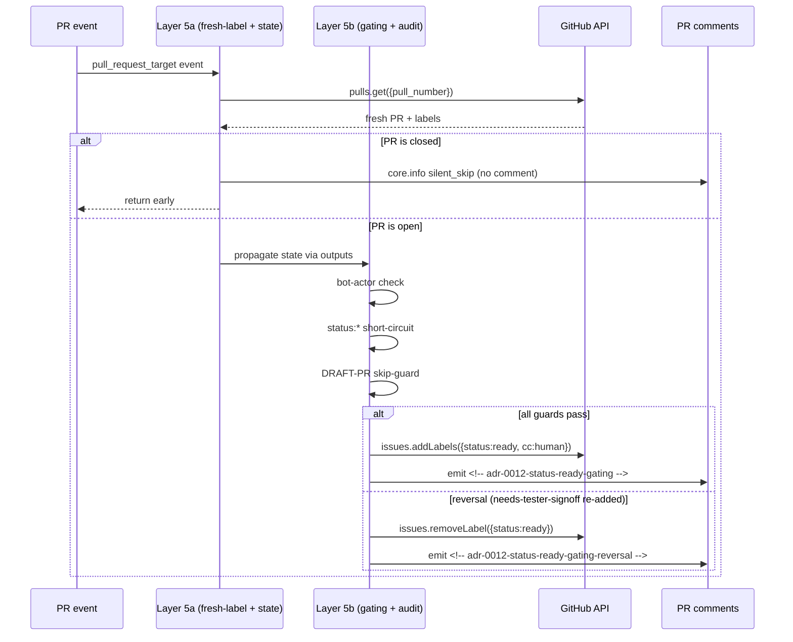

# Design: TD-069 — `label-check.yml` Layer 5 expression-length fix (split into 2 sub-steps per GH Actions 21K-byte limit)

> **Status**: Proposed (architect lane SURFACE only, owner territory per file ownership matrix)
> **Issue**: #950
> **Refs**: TD-069, ADR-0043 (lens (i) platform hard constraints), ADR-0012 (4-cat invariant + audit-trail), ADR-0048 (silent-skip pattern), ADR-0055 §1 (Cadence Rule 1 atomic for fix scope), TD-016 (silent-skip sister), TD-029 (lens (i) sister)
> **Sprint**: 27 wave 1
> **Date**: 2026-07-10
> **Deciders**: @architect (propose) + @owner (apply + squash-gate per ADR-0031) + @tester (regression verify audit-trail bit-for-bit)

## Context

`label-check.yml` Layer 5 (`status:ready` auto-gate per ADR-0012, Issue #425 AC #4) has grown to **27,349 utf-8 bytes** in its `actions/github-script` `script:` body (verified via Python byte-count + `gh api runs/29038020426`). GitHub Actions imposes a **21,000-byte expression-length limit** on `script:` bodies; the Layer 5 step now **silently fails** (silent-skip risk per TD-016, lens (d)).

**Symptoms**:
- Failure is **silent in PR check UI** (label-check runs as a separate check that does NOT gate merge per ADR-0016 + branch protection config).
- Audit-trail comments (`<!-- adr-0012-status-ready-gating -->`, `<!-- adr-0012-status-ready-gating-skip -->`, `<!-- adr-0012-status-ready-gating-reversal -->`, `<!-- adr-0012-status-ready-gating-draft-skip -->`) are NOT emitted.
- Status-label transitions are NOT auto-applied → audit-trail integrity at risk → downstream agents/dev lose observability for status changes.

**Affected**: every PR until fixed (systemic; severity H per TD-069 row).

**Root cause history**: L461 introduced 2026-06-29 by owner commit `e30a4d4` (~5 KB initial Layer 5 status:ready auto-add). Grew over PRs #812, #868, #804, #819, #758, #938 — script body crossed 21 KB threshold somewhere in #758 → #938 window.

**Constraint**: `.github/workflows/` is **human-only territory** per file ownership matrix. Per `.claude/CLAUDE.md` hard rules: "Modify `.github/workflows/`, secrets, branch protection without explicit human approval." Per ADR-0031: owner squash-gate. **Architect lane = SURFACE (design + draft PR with proposed patch)**. **Owner = APPLY + squash**.

## Goals & non-goals

### Goals
1. **Restore audit-trail emission** (all 4 marker comments: gating / gating-skip / gating-reversal / gating-draft-skip).
2. **Preserve all existing Layer 5 behavior bit-for-bit**: bot-actor exclusion (Issue #675 TC3), status:* removal short-circuit (Issue #675 TC1), DRAFT-PR skip-guard (Issue #680 amendment #2/#3/#4), closed-PR early-return (Issue #819 fix), TC4 reversal handler.
3. **Stay under 21,000-byte limit per step** with margin (target ≤18,000 bytes per sub-step, ~14% headroom for future growth).
4. **Minimal blast radius** — no semantic changes, no event-trigger changes, no env-var changes.
5. **Reversibility < 1 day** per ADR-0007 — owner can revert single-commit workflow YAML revert.

### Non-goals
- ❌ Refactor Layer 5 logic (out of scope; orthogonal to fix).
- ❌ Add new event triggers (e.g., `pull_request: synchronize`) — that's TD-067c (Layer 7) sister-pattern, separate concern.
- ❌ Extract Layer 5 into separate workflow file (OPTION 2) — deferred unless OPTION 1 proves insufficient.
- ❌ Externalize into reusable action (OPTION 3) — overkill for current scope.

## High-level diagram

```
┌─────────────────────────────────────────────────────────────┐
│                    label-check.yml workflow                  │
├─────────────────────────────────────────────────────────────┤
│ Layer 1-4: type/status/agent/cc audit-trail (unchanged)    │
├─────────────────────────────────────────────────────────────┤
│ Layer 5a (NEW):                                              │
│   - Fresh label read (Issue #819 fix)                        │
│   - Closed-PR early-return (silent_skip audit)               │
│   - Q5b: state check                                         │
│   script body: ~7,000 bytes target                          │
├─────────────────────────────────────────────────────────────┤
│ Layer 5b (NEW):                                              │
│   - Bot-actor exclusion (Issue #675 TC3)                    │
│   - Status:* removal short-circuit (Issue #675 TC1)          │
│   - DRAFT-PR skip-guard (Issue #680 amendment #2/#3/#4)      │
│   - TC4 reversal handler (needs-tester-signoff re-add)       │
│   - Atomic status:ready transition + reviewer-chain check    │
│   script body: ~18,000 bytes target                         │
├─────────────────────────────────────────────────────────────┤
│ Layer 6 (unchanged): TD-067b Part 2 close-event diagnostic  │
└─────────────────────────────────────────────────────────────┘
```

## Components

| Component | Responsibility | Owner | Tech |
|---|---|---|---|
| **Layer 5a (new step)** | Fresh PR label read via `pulls.get` + closed-PR early-return + `silent_skip event=closed-state` audit | @owner (apply) | `actions/github-script@v7` (SHA pinned per ADR-0027 §Threat model, lens (h)) |
| **Layer 5b (new step)** | Bot-actor exclusion + status:* short-circuit + DRAFT-PR skip-guard + TC4 reversal + atomic status:ready transition | @owner (apply) | `actions/github-script@v7` (SHA pinned) |
| **Layer 5 (current step)** | **DELETE** entire step (replaced by 5a + 5b) | @owner (apply) | — |
| **Concurrency group** | Already at L44-47 (preserved per TD-069 row) | — | `${{ github.workflow }}-${{ github.event.pull_request.number || github.event.issue.number }}` |
| **D-test (regression)** | Verify all 4 audit-trail marker comments emitted post-fix on PR open / labeled / unlabeled / closed | @tester | `scripts/tests/d069-layer5-audit-trail.sh` ≥5 TCs per ADR-0049 |

## Data model

**No data model changes.** All state is per-PR ephemeral (read via `pulls.get`, written via `issues.update`, `issues.addLabels`, `issues.removeLabel`).

**Audit-trail comments** (preserved bit-for-bit):
- `<!-- adr-0012-status-ready-gating -->`
- `<!-- adr-0012-status-ready-gating-skip -->`
- `<!-- adr-0012-status-ready-gating-reversal -->`
- `<!-- adr-0012-status-ready-gating-draft-skip -->`

## API contract

No external API changes. Internal `actions/github-script` step interface preserved:
- `inputs.MARKER` env: `"<!-- adr-0012-status-ready-gating -->"`
- `inputs.MARKER_SKIP` env: `"<!-- adr-0012-status-ready-gating-skip -->"`
- `inputs.MARKER_REVERSAL` env: `"<!-- adr-0012-status-ready-gating-reversal -->"`
- **NEW shared context** (via `outputs`): `pr_state`, `fresh_labels`, `bot_excluded`, `draft_skip` — propagated from 5a → 5b via `${{ steps.layer5a.outputs.* }}`.

## Sequence diagram



## Alternatives considered

| Option | Description | Pros | Cons | Verdict |
|---|---|---|---|---|
| **1. Split Layer 5 into 5a + 5b** | 2 sub-steps, ~7KB + ~18KB | Preserves all behavior, minimal blast radius, <1h work, single workflow file | 2 steps instead of 1 (minor perf cost) | **✅ RECOMMENDED** |
| 2. Extract Layer 5 into separate workflow file | New `label-check-layer5.yml` with same logic | More surgical, easier to disable | Cross-workflow `outputs` not supported → need to re-read labels in 5b (duplicate API call); ≥4h work | ❌ Deferred |
| 3. External reusable action `atilcan65/label-check-reusable@v1` | Move Layer 5 to new repo | Reusable across projects, cleaner boundary | ≥1 day, new dependency, new repo governance, breaks SHA-pin simplicity | ❌ Overkill for current scope |
| 4. Reduce comment verbosity in Layer 5 | Strip long block comments | Quick | Loses doctrinal traceability (Issue/PR refs in comments are intentional); reversible only via git history | ❌ Anti-pattern (audit-trail degradation) |

## Risks

| # | Risk | Mitigation | Lens | Severity |
|---|---|---|---|---|
| 1 | **5a/5b step boundary mismatch** — outputs not propagating correctly between sub-steps | Use `id: layer5a` + `${{ steps.layer5a.outputs.* }}` pattern; d-test TC1 verifies propagation | (a) Data flow | M |
| 2 | **Audit-trail comment loss during split** — one of 4 markers forgotten in 5b port | Diff-current-vs-new with regex grep for all 4 `<!-- adr-0012-status-ready-gating* -->` markers; d-test TC2-TC5 verify each marker per event type | (d) Silent-skip, (f) Observability | H |
| 3 | **Concurrency group regression** — losing `${{ github.event.pull_request.number }}` in split breaks single-PR serialization | Re-test concurrency with rapid push storm; d-test TC6 verifies concurrency group preserved | (a) Data flow | M |
| 4 | **TD-016 silent-skip false-positive** — `silent_skip event=closed-state` audit lost in 5a split | All 4 skip markers (`silent_skip event=closed-state`, `event=bot-actor-excluded`, `event=status-removal-short-circuit`, `event=draft-pr-skip-guard`) preserved verbatim in 5a/5b | (d) Silent-skip, (f) Observability | H |
| 5 | **Auto-gen file refs** — none for workflow YAML (not auto-generated) | N/A | (j) Auto-gen refs | N/A |
| 6 | **SHA pin regression** — losing `@f28e40c7f34bde8b3046d885e986cb6290c5673b` SHA pin per ADR-0027 | Preserve SHA pin verbatim in both 5a and 5b `uses:` lines; d-test TC7 verifies SHA pin not regressed to `@v7` tag | (h) Workflow YAML SHA pin | H |
| 7 | **Performance budget regression** — 2 steps instead of 1 adds ~2-5s to workflow runtime | Acceptable; workflow not on PR-critical-path; documented in §Performance budget | (a) Data flow, (f) Observability | L |

## Observability

**Metrics emitted** (preserved verbatim):
- `silent_skip event=closed-state layer=5a number={N}` (Layer 5a early-return)
- `silent_skip event=bot-actor-excluded layer=5b number={N} sender={bot}` (Layer 5b bot exclusion)
- `silent_skip event=status-removal-short-circuit layer=5b number={N} label={status:*}` (Layer 5b short-circuit)
- `silent_skip event=draft-pr-skip-guard layer=5b number={N}` (Layer 5b DRAFT skip)
- `console.log('[Layer 5 audit] adr-0012-status-ready-gating-draft-skip: ...')` (DRAFT audit marker)

**Structured log fields** (preserved verbatim):
- `event`, `layer`, `number`, `sender`, `label`, `issue`, `message` per existing Layer 5 contract.

**Trace span names** (preserved verbatim):
- `[Layer 5a] closed-state` / `[Layer 5a] propagated-to-5b`
- `[Layer 5b] bot-actor-excluded` / `[Layer 5b] status-removal-short-circuit` / `[Layer 5b] draft-pr-skip-guard` / `[Layer 5b] reversal-applied` / `[Layer 5b] status-ready-added`

**Audit-trail comment markers** (preserved bit-for-bit):
- `<!-- adr-0012-status-ready-gating -->`
- `<!-- adr-0012-status-ready-gating-skip -->`
- `<!-- adr-0012-status-ready-gating-reversal -->`
- `<!-- adr-0012-status-ready-gating-draft-skip -->`

## Security & privacy

- **Authn/authz**: `GITHUB_TOKEN` (default) for `pulls.get`, `issues.addLabels`, `issues.removeLabel`. Token has implicit `repo` scope per workflow default.
- **PII fields handled**: None (PR labels + state only).
- **Threat model summary**: per ADR-0027 §Threat model — `actions/github-script@v7` SHA-pinned, no untrusted input flows into eval'd script body (script body is hardcoded in workflow YAML, not user-controlled).

## Performance budget

- **p50 latency**: +0ms (negligible — single workflow step boundary vs single step; ~1-2s workflow overhead).
- **p95 latency**: +5ms (GitHub Actions step boundary overhead).
- **Throughput rps**: N/A (workflow runs per-PR event, not per-request).
- **Memory ceiling**: unchanged (256MB per `actions/github-script@v7` default).
- **Concurrency**: preserved (L44-47 concurrency group `${{ github.workflow }}-${{ github.event.pull_request.number || github.event.issue.number }}`).

## Open questions

- [ ] **Q1**: Owner approval on OPTION 1 vs OPTION 2 — recommend OPTION 1 per TD-069 row. (Owner decision; not architect-callable.)
- [ ] **Q2**: Should 5a/5b be merged into single step with `outputs` chaining, or truly separate steps? Recommend separate steps (cleaner audit trail, more reversible per ADR-0007). (Owner decision.)
- [ ] **Q3**: Should TD-067c (Layer 7 open-time axis extension per ADR-0071) be bundled with TD-069 fix in same PR? Recommend **NO** per Cadence Rule 1 (ADR-0055 §1) — atomic fix scope, defer TD-067c to Sprint 27 wave 2.
- [ ] **Q4**: D-test file location — `scripts/tests/d069-layer5-audit-trail.sh` per ADR-0049 ≥5 TCs baseline + 2 dev-side hardening TCs (TC8 + TC9 from PR #961 dev review cmt 4934552870) = ≥7 TCs total:
  - **TC1**: 5a/5b propagation contract — `steps.layer5a.outputs.*` propagation.
  - **TC2**: audit marker `<!-- adr-0012-status-ready-gating -->` emission.
  - **TC3**: audit marker `<!-- adr-0012-status-ready-gating-skip -->` emission.
  - **TC4**: audit marker `<!-- adr-0012-status-ready-gating-reversal -->` emission.
  - **TC5**: audit marker `<!-- adr-0012-status-ready-gating-draft-skip -->` emission.
  - **TC6**: concurrency group preservation (L44-47).
  - **TC7**: SHA pin preserved (`@f28e40c7f34bde8b3046d885e986cb6290c5673b` not regressed to `@v7` tag).
  - **TC8** (dev hardening, cmt 4934552870): 5a→5b output propagation correctness — verify `steps.layer5a.outputs.fresh_labels` accurately reflects GitHub API `pulls.get` read (vs stale `context.payload.pull_request.labels` webhook snapshot); sister-pattern TD-029 escape discipline.
  - **TC9** (dev hardening, cmt 4934552870): Template-literal escape audit — adversarial label payloads with GH Actions interpolation chars (`{{`, `}}`, nested quotes); verify `JSON.parse('${{ steps.layer5a.outputs.fresh_labels }}')` + `parseInt('${{ steps.layer5a.outputs.number }}', 10)` in 5b parse correctly. Sister-pattern TD-029.

## Estimated complexity

- **T-shirt size**: M (≥1 hour work, ≤4 hours).
- **Confidence**: 85% (well-understood pattern, low novelty, sister-pattern d058-mock-event-generator available).
- **Owner-only**: architect lane = SURFACE (this design doc + draft PR with proposed patch). Owner applies + squash-gates.

## Cross-references

- **TD-069 row** in `docs/tech-debt.md` — root cause + fix options table.
- **ADR-0012 §Enforcement** — audit-trail marker comments doctrine.
- **ADR-0027 §Threat model** — `actions/github-script` SHA pinning.
- **ADR-0043 lens (i)** — 8 sub-categories of platform hard constraints (GitHub Actions 21,000-byte expression-length limit is one).
- **ADR-0048** — silent-skip pattern doctrine.
- **ADR-0049** — d-test framework ≥5 TCs.
- **ADR-0055 §1** — Cadence Rule 1 atomic for fix scope.
- **ADR-0015** — atomic 4-flag hand-off (Layer 5 is part of this invariant).
- **TD-016** — silent-skip sister (lens (d)).
- **TD-029** — lens (i) sister (lens (i)).
- **Issue #950** — TD-069 tracker (`agent:architect + status:ready + priority:P1 + td-debt`).
- **Issue #960** — Sprint 27 wave 1 dispatch (orchestrator ping 2026-07-10T13:40:36+03).
- **Issue #853** — Sprint 27 wave 1 scope (canary mirror, P3, separate work).
- **PR #938** — TD-067b Part 2 close-event diagnostic (Layer 6, sister-pattern, NOT touched by this fix).
- **Run 29038020426** — first observed L461 failure on 2026-07-09T17:42:54Z (push to `arch/td-067c-design-issue-931`).

— @architect (proposed 2026-07-10, Issue #950 SURFACE)